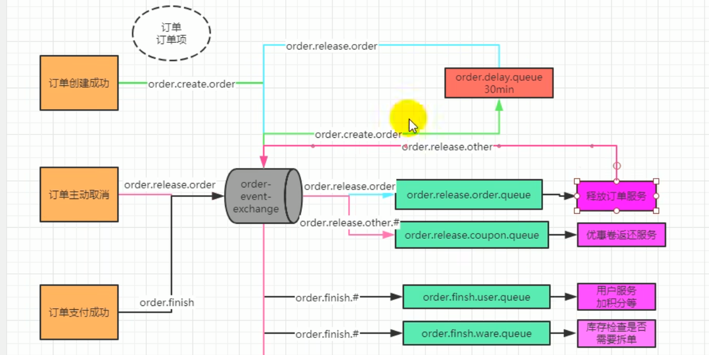
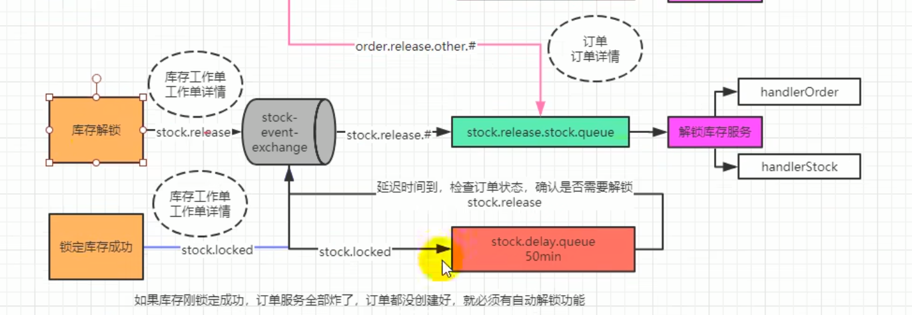
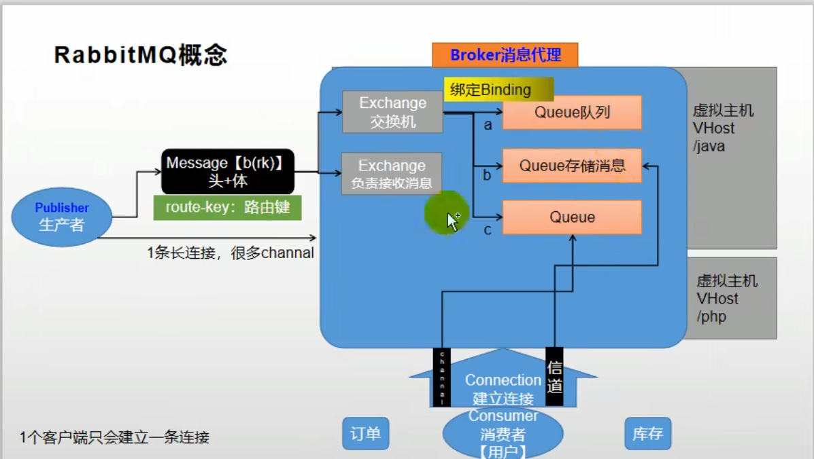
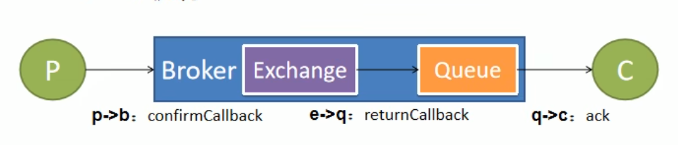

## mall商城项目

---
#### mybatis-plus

---
> ##### 配置
```yml

mybatis-plus:
  mapper-locations:  classpath:/mapper/**/*.xml
  global-config:
    db-config:
      id-type: auto
      logic-delete-value: 0 # 逻辑删除 配合TableLogic
      logic-not-delete-value: 1 # 逻辑没删除 配合TableLogic
  configuration:
  # map-underscore-to-camel-case: true # 使用该配置可以让mybatis自动将SQL中查出来的带下划线的字段，转换为驼峰标志，再去匹配类中的属性。
```
> ##### @Mapper和@MapperScan的区别
@Mapper是mapper接口上面都要加的,@MapperScan是加在启动类上面的,直接扫描mapper接口所在的包,而不用家@Mapper
> ##### 查询
```java
 new LambdaQueryWrapper<BrandEntity>()
        // 以下三个的写法都可以
        // 第一个条件
        .like(true, // 这个参数表示是否这个条件生效,可以写成表达式
            BrandEntity::getName, // 要查询的对应数据库的pojo属性名
            (String)params.get("key")) // 条件值
        // 第二个条件链式
        .or()
        .like(true,
            BrandEntity::getDescript,
            (String)params.get("key"))
        // 第三个条件Lambda形式
        .or(true, wrapper -> {
            wrapper.like(true,
                    BrandEntity::getFirstLetter,
                    (String)params.get("key"));
        })
```

##### @Transactional(readOnly = false, rollbackFor = NoStockException.class)
可以这样写，也可以只写@Transactional，默认运行时异常都会回滚

##### 事务
###### 本地事务
```java
 /**
     * 本地事务注解@Transactional
     *
     * 事务隔离级别设置
     * @Transactional(isolatfion = Isolation.REPEATABLE_READ)
     *
     *  事务隔离级别(从小到大)：
     *      READ_UNCOMMITTED(未读提交)：可以读到其他没有提交得事务得数据，这个现象也称之为脏数据，别人可能异常回滚，那么读到得就是无效数据
     *           公司发工资了，领导把5000元打到singo的账号上，但是该事务并未提交，
     *           而singo正好去查看账户，发现工资已经到账，是5000元整，非常高 兴。
     *           可是不幸的是，领导发现发给singo的工资金额不对，是2000元，于是迅速回滚了事务，
     *           修改金额后，将事务提交，最后singo实际的工资只有 2000元，singo空欢喜一场
     *
     *      READ_COMMITTED(读提交)：一个事务可以读取另一个已经提交得事务，多次读取会造成不一样得结果，这个现象称为不可重复读问题
     *           singo拿着工资卡去消费，系统读取到卡里确实有2000元，而此时她的老婆也正好在网上转账，
     *           把singo工资卡的2000元转到另一账户，并在 singo之前提交了事务，当singo扣款时，
     *           系统检查到singo的工资卡已经没有钱，扣款失败，singo十分纳闷，明明卡里有钱
     *
     *      REPEATABLE_READ(可重复读)：MySQL得默认隔离级别，在同一个事务里，select得结果是事务开始时间点状态，因此同样得select操作读到得结果是一样得，但是会有幻读现象
     *          当隔离级别设置为Repeatable read 时，可以避免不可重复读。当singo拿着工资卡去消费时，
     *          一旦系统开始读取工资卡信息（即事务开始），singo的老婆就不可能对该记录进行修改，也就是singo的老婆不能在此时转账
     *
     *          事务A在执行读取操作，需要两次统计数据的总量，前一次查询数据总量后，此时事务B执行了新增数据的操作并提交后，
     *          这个时候事务A读取的数据总量和之前统计的不一样，就像产生了幻觉一样，平白无故的多了几条数据，成为幻读
     *      SERIALIZABLE(序列化)：在这个隔离级别下事务都是串行顺序执行得
     *
     * 事务得传播行为设置
     * @Transactional(propagation = Propagation.REQUIRED)
     *
     *  事务得传播行为：
     *      PROPAGATION_REQUIRED:如果当前没有事务，就创建一个新的事务，如果当前存在事务，就加入该事务，使用当前事务得配置 最常用 默认
     *      PROPAGATION_SUPPORTS:支持当前事务，如果当前存在事务，就加入该事务，如果当前不存在事务，就以非事物执行
     *      PROPAGATION_MANDATORY:支持当前事务，如果当前存在事务，就加入该事务，如果当前不存在事务，就以抛出异常
     *      PROPAGATION_REQUIRED_NEW:创建新事务，无论当前村不存在事务，都创新事务,使用新得配置
     *      PROPAGATION_NOT_SUPPORTED:以非事务方式执行操作，如果当前存在事务，就吧当前事务挂起
     *      PROPAGATION_NEVER:以非事务方式执行操作，如果当前存在事务，则抛出异常
     *      PROPAGATION_NESTED:如果当前存在事务，则在嵌套事务内执行，如果当前没有事务，则执行和PROPAGATION_REQUIRED相似得操作
     *
     */

// 事务隔离级别设置
@Transactional(isolation = Isolation.REPEATABLE_READ)
public void a(){
        /**
         * b();
         * c();
         * 如果a，b，c三个事务是在同一个类中，那么b，c做的人和设置都没用，都是和a共用一个事务 直接这样调用就是吧c，b得代码放到了a中
         *
         * 因为事务是使用代理对象来控制得，所以调用本类得其他事务，那么其他事务失效，但是可以调用其他类得事务
         * 如果要调用本类得事务，解决办法如下:
         *      引入spring-boot-starter-aop,要使用aspectjweaver代理
         *      开启aspectjweaver动态代理功能@EnableAspectJAutoProxy(exposeProxy = true) 配置是对外暴露代理对象 以后所有得动态代理都是aspectjweaver来创建(没有接口也能创建)
         *      用代理对象调用
         */


        OrderServiceImpl orderService = (OrderServiceImpl) AopContext.currentProxy();
        orderService.b();
        orderService.c();

        // a和b都在一个事务里面
        // c是一个新得事务
        // 出现异常之后，如果a或者b出现异常，那么a和b都会回滚 c不回滚   如果是c出现异常，只是c回滚
        }


// 事务得传播行为设置
    @Transactional(propagation = Propagation.REQUIRED)
    public void b(){

    }

    // 事务得传播行为设置
    @Transactional(propagation = Propagation.REQUIRES_NEW)
    public void c(){

    }
```

###### 分布式事务

> CAP原则
> 
> - 一致性、可用性、分区容错性，CAP原则是指，这三个要素最多只能实现两个，不可能三个同时实现，在分布式系统中永远都要满足分区容错，所以只能CA二选一
> > - 一致性：成功就一起成功，失败也一起失败，保存一个值那么都保存一个值，在分布式系统中所有数据备份，在同一时刻必须有同样得值
> > - 可用性：在集群中一部分节点故障后，集群整体还能响应客户端得读写请求
> > - 分区容错性：大多数情况下，分布式系统都分布在多个子网络，每个子网络就叫做一个区，分区容错就是，区之间通信可能失败

> raft算法(保证一致性)

[动画解析](https://zinglix.xyz/2020/06/25/raft/)

> BASE理论
> 
> - 基本可用:损失时间(以前1秒得操作,现在5秒),损失功能(双11得时候,购物高峰期,可以引导用户去另一个页面)
> - 软状态:指允许系统存在中间状态,而该中间状态不会影响系统整体可用性,分布式一般都会将数据存储多份,允许同步延迟就是软状态得体现
> - 最终一致性:最终一致性指得是所有得数据经过一段时间后,最终达到一致得状态,弱一致和强一致相反,最终一致性是弱一致性得一种特殊情况

> 分布式事务方案
> 
> > - 2PC(强一致):二阶提交,分两个阶段提交,影响性能
> > > - 总事务管理器询问微服务得本地管理器准备好提交数据了吗,响应准备好了,这一个阶段是询问状态
> > > - 总事务管理器发送提交指令给微服务,如果有某一个微服务没有成功提交就回滚,这是第二阶段
> 
> > - TCC(弱一致):柔性事务,TCC事务补偿型方案
> > > - 让开发人员开发得时候开发三个代码提供给业务活动管理器回调,第一个Try尝试阶段,准备数据,第二个Confirm提交,第三个Cancel回滚
> > > - 提供这三个代码让业务活动管理器调用
> 
> > - 柔性事务-最大努力通知型
> > > - 如果一个事务调用了多个微服务,那么有某一个微服务执行失败了,就将信息放到MQ中,让其他得微服务来订阅
> > > - 如果之前得某个微服务断线了,那么可以设置这个MQ消息一直发送,直到真正收到为止
>
> > - 柔性事务-可靠消息+最终一致性方案(购物车结算得时候我们使用这个)
> > > - 和`柔性事务-最大努力通知型`类似

> Seata(分布式事务解决方案得具体实现,由Alibaba提供)
>
> 术语:
> > TC:事务协调者,维护全局和分支事务,驱动全局事务提交或者回滚,控制全局
> 
> > TM:事务管理器,定义全局事务得范围,开始全局事务,提交或回滚全局事务,管理大事务,也就是在哪里开启得调用远程服务哪里就是TM
> 
> > RM:资源管理器,管理分支事务处理得资源,与TC交谈以注册分支事务和报告分支事务得状态,并驱动分支事务提交和回滚,被调用得其他微服务就是RM
> 
###### 使用seata-不考虑高并发
> 创建undo_log数据表,分布式事务得数据库都创建,用于分布式事务回滚日志 建表脚本在源码中的script目录去找
 ```sql
CREATE TABLE `undo_log` (
    `id` bigint(20) NOT NULL AUTO_INCREMENT,
    `branch_id` bigint(20) NOT NULL,
    `xid` varchar(100) NOT NULL,
    `context` varchar(128) NOT NULL,
    `rollback_info` longblob NOT NULL,
    `log_status` int(11) NOT NULL,
    `log_created` datetime NOT NULL,
    `log_modified` datetime NOT NULL,
    `ext` varchar(100) DEFAULT NULL,
    PRIMARY KEY (`id`),
    UNIQUE KEY `ux_undo_log` (`xid`,`branch_id`) USING BTREE
) ENGINE=InnoDB DEFAULT CHARSET=utf8;
```
>  [`下载Seata-Server事务协调器(TC)`](https://github.com/seata/seata/releases)
> 
>  [`下在Seata-Server对应版本源码`](https://github.com/seata/seata)
> 
>  修改Seata-Server得registry.conf中得配置文件位置和注册中心位置,如下配置
```text
# 配置注册中心得位置
registry {

  type = "nacos"

  nacos {
    application = "seata-server"
    serverAddr = "127.0.0.1:8848"
    group = "SEATA_GROUP"
    namespace = "mall-dev"
    cluster = "default" # 集群名字
    username = "nacos"
    password = "nacos"
  }
}

# 配置配置文件得位置
config {

  type = "nacos"

  nacos {
    serverAddr = "127.0.0.1:8848"
    namespace = "mall-dev"
    group = "SEATA_GROUP"
    username = "nacos"
    password = "nacos"
  }
}
```
>
>  修改file.conf,主要就是 TC事务日志存储在哪里 如下配置
```text
# TC日志存放位置
store {

  mode = "db"

  db {
    datasource = "druid"
    dbType = "mysql"
    driverClassName = "com.mysql.jdbc.Driver"
    url = "jdbc:mysql://127.0.0.1:3306/seata_server?rewriteBatchedStatements=true" # 创建出来
    user = "root"
    password = "lqs"
    minConn = 5
    maxConn = 100
    globalTable = "global_table" # 创建出来
    branchTable = "branch_table" # 创建出来
    lockTable = "lock_table" # 创建出来
    queryLimit = 100
    maxWait = 5000
  }
}
```
>
> > - 创建global_table 建表脚本在源码中的script目录去找
```sql
CREATE TABLE IF NOT EXISTS `global_table`
(
    `xid`                       VARCHAR(128) NOT NULL,
    `transaction_id`            BIGINT,
    `status`                    TINYINT      NOT NULL,
    `application_id`            VARCHAR(32),
    `transaction_service_group` VARCHAR(32),
    `transaction_name`          VARCHAR(128),
    `timeout`                   INT,
    `begin_time`                BIGINT,
    `application_data`          VARCHAR(2000),
    `gmt_create`                DATETIME,
    `gmt_modified`              DATETIME,
    PRIMARY KEY (`xid`),
    KEY `idx_gmt_modified_status` (`gmt_modified`, `status`),
    KEY `idx_transaction_id` (`transaction_id`)
) ENGINE = InnoDB
  DEFAULT CHARSET = utf8;
```
>
> > - 创建branch_table 建表脚本在源码中的script目录去找
```sql
CREATE TABLE IF NOT EXISTS `branch_table`
(
    `branch_id`         BIGINT       NOT NULL,
    `xid`               VARCHAR(128) NOT NULL,
    `transaction_id`    BIGINT,
    `resource_group_id` VARCHAR(32),
    `resource_id`       VARCHAR(256),
    `branch_type`       VARCHAR(8),
    `status`            TINYINT,
    `client_id`         VARCHAR(64),
    `application_data`  VARCHAR(2000),
    `gmt_create`        DATETIME(6),
    `gmt_modified`      DATETIME(6),
    PRIMARY KEY (`branch_id`),
    KEY `idx_xid` (`xid`)
) ENGINE = InnoDB
  DEFAULT CHARSET = utf8;
```
>
> > - 创建lock_table 建表脚本在源码中的script目录去找
```sql
CREATE TABLE IF NOT EXISTS `lock_table`
(
    `row_key`        VARCHAR(128) NOT NULL,
    `xid`            VARCHAR(128),
    `transaction_id` BIGINT,
    `branch_id`      BIGINT       NOT NULL,
    `resource_id`    VARCHAR(256),
    `table_name`     VARCHAR(32),
    `pk`             VARCHAR(36),
    `gmt_create`     DATETIME,
    `gmt_modified`   DATETIME,
    PRIMARY KEY (`row_key`),
    KEY `idx_branch_id` (`branch_id`)
) ENGINE = InnoDB
  DEFAULT CHARSET = utf8;
```
> 
> 配置上线注册到nacos得配置 在源码中的script目录去找到 config-center下得config.txt修改如下配置
```txt
store.mode=db
store.db.url=jdbc:mysql://127.0.0.1:3306/seata_server?useUnicode=true&rewriteBatchedStatements=true
store.db.user=root
store.db.password=lqs

service.vgroupMapping.chengdu=default # vgroupMappin后面得可以随便写但是要记住这个很重要,配置客户端得时候会用到,这个default可以修改但是必须和注册中心集群名字一样 这个配置也就是集群得时候用得
```
> 
> nacos得到源码中的script目录中config-center下得config.txt中的配置
```shell
# 可以根据自己得需要修改这个文件
bash config-center/nacos/nacos-config.sh
```
>
> 以上成功之后 启动seata
```shell
bash bin/seata-server.sh -p 端口 -n 节点数量
```
> 
###### 整合seata

> 导入Seata依赖 spring-cloud-starter-alibaba-seata 默认还对导入seata-all seata-all得版本必须和下载得seata-server版本一样
```xml
<!--        seata事务协调器-->
<dependency>
    <groupId>com.alibaba.cloud</groupId>
    <artifactId>spring-cloud-starter-alibaba-seata</artifactId>
</dependency>
```
> 配置application.properties
```properties

seata.tx-service-group=chengdu
seata.enabled=true
seata.application-id=${spring.application.name}
seata.enable-auto-data-source-proxy=true

seata.config.type=nacos
seata.config.nacos.group=SEATA_GROUP
seata.config.nacos.server-addr=localhost
seata.config.nacos.namespace=mall-dev
seata.config.nacos.password=nacos
seata.config.nacos.username=nacos


seata.registry.type=nacos
seata.registry.nacos.group=SEATA_GROUP
seata.registry.nacos.application=seata-server
seata.registry.nacos.server-addr=localhost
seata.registry.nacos.namespace=mall-dev
seata.registry.nacos.password=nacos
seata.registry.nacos.username=nacos

```
> 使用分布式事务 将@GlobalTransactional注解放在TM上
> 
> 如果TM出现异常,那么RM和TM都回滚,如果RM出现异常并且被处理(如try...catch),那么TC就感知不到,在TM中根据状态码来手动抛出异常回滚所有事务 或者GlobalTransactionContext.reload(RootContext.getXID()).rollback();手动回滚
> 
> 如果TM出现异常,那么RM和TM都回滚,如果RM中出现异常没有被处理,那么TC就可以感知到,并且直接回滚所有事务
> 
```java
    @GlobalTransactional
    @Transactional(readOnly = false)
    @Override
    public SubmitOrderResponseVo submitOrder(OrderSubmitVo orderSubmitVo){

        SubmitOrderResponseVo submitOrderResponse=new SubmitOrderResponseVo();

        orderSubmitVoThreadLocal.set(orderSubmitVo);

        AccountRespTo account=UserLoginInterceptor.user.get();

        // 验证令牌
        String orderToken=orderSubmitVo.getOrderToken();
        
        ......
}
```

###### 柔性事务-可靠消息+最终一致性方案(RabbitMQ)
> 我们使用这个方式来处理保存订单和锁定库存得分布式事务业务,使用延时队列来做,无论是下单失败还是锁定库存失败,通过延时队列,最终都会以补偿得方式回滚,交换机最好用Topic模式
> ,如果要使用这个模式,最好还是数据表不要太单一,比如我们系统里有库存表,库存工作单表,库存工作单详情表,订单表这些表具有明确得指向性,比如,我们知道库存表一张表,如果锁定了库存,
> 我们并不知道究竟是哪个用户锁定了库存,如果有工作单和详情单,我们就可以知道谁锁定了库存锁定了多少,再配合mq得消息,就可以准确得解锁.当然也可以不建立这些表,通过发送得mq信息来解锁.

> 延时队列
>  
> > 延时队列:给队列设置一个ttl,到了指定得ttl里面得消息就会变成死信,这个被设置了ttl得就是延时队列,不能被消费者监听
> 
> > 死信:就是延时队列中过期得信息,死信在通过交换机发送给另外一个队列,只要有消费者来监听这个队列就可以获取这个死信来执行对应得业务

> 我们系统得`保存订单和锁定库存得分布式事务业务`



#### 分布式解决方案

---
##### SpringCloudAlibaba
> - [`下载nacos(文档)`](https://nacos.io/zh-cn/)

> - [`查看各个版本的对应信息`](https://github.com/alibaba/spring-cloud-alibaba/wiki/版本说明) 

> - [`springcloudalibaba项目地址(文档)`](https://github.com/alibaba/spring-cloud-alibaba)

###### 在共用工程中添加SpringCloudTencent依赖
```xml
 <dependencies>
    <!--        nacos注册中心,服务的注册发现-->
    <dependency>
        <groupId>com.alibaba.cloud</groupId>
        <artifactId>spring-cloud-starter-alibaba-nacos-discovery</artifactId>
    </dependency>

    <!--        nacos配置管理-->
    <dependency>
        <groupId>com.alibaba.cloud</groupId>
        <artifactId>spring-cloud-starter-alibaba-nacos-config</artifactId>
    </dependency>
</dependencies>

<dependencyManagement>
    <dependencies>
        <!--            springcloudaliibaba依赖-->
        <dependency>
            <groupId>com.alibaba.cloud</groupId>
            <artifactId>spring-cloud-alibaba-dependencies</artifactId>
            <type>pom</type>
            <scope>import</scope>
            <version>${spirng-cloude-alibaba.version}</version>
        </dependency>
    </dependencies>
</dependencyManagement>

```

###### 各个微服务需要的配置
> - 在SpringCloudAlibaba中如果配置中心要和服务注册一起使用或者只用配置中心,那么需要配置到bootstrap.properties中,否则随便配置在哪里

> - 使用nacos配置中心的时候，springboot的版本太高，不能够读取naccos配置中心的配置，所以使用高版本的时候导入这个坐标,解决配置中心读取不到bootstrap.properties配置文件的

```xml
<dependency>
    <groupId>org.springframework.cloud</groupId>
    <artifactId>spring-cloud-starter-bootstrap</artifactId>
</dependency>
```
```properties
spring.application.name=mall-order

# springcloudtencent配置
# 注册中心配置
spring.cloud.nacos.discovery.server-addr=127.0.0.1:8848
spring.cloud.nacos.discovery.namespace=mall-dev

# 配置中心配置
spring.cloud.nacos.config.server-addr=127.0.0.1:8848
spring.cloud.nacos.config.namespace=mall-dev

## 从配置中心中同时加载多个配置(拆分之后）
## 如数据源配置文件，mybatis配置文件，redis配置文件等等，读取了之后，会和本地的application组合
##导入一个文件
spring.cloud.nacos.config.extension-configs[0].data-id=mysql.yaml
spring.cloud.nacos.config.extension-configs[0].group=order-config
spring.cloud.nacos.config.extension-configs[0].refresh=true


spring.cloud.nacos.config.extension-configs[1].data-id=mybatis.yaml
spring.cloud.nacos.config.extension-configs[1].group=order-config
spring.cloud.nacos.config.extension-configs[1].refresh=true
```


##### SpringCloudTencent
> - [`下载polaris(文档)`](https://polarismesh.cn/)

> - [`查看各个版本的对应信息`](https://github.com/Tencent/spring-cloud-tencent/wiki/Spring-Cloud-Tencent-版本管理)

> - [`springcloudtencent项目地址(文档)`](https://github.com/Tencent/spring-cloud-tencent)
###### 在共用工程中添加SpringCloudTencent依赖
```xml
 <dependencies>
    <!--        polaris配置中心-->
    <dependency>
        <groupId>com.tencent.cloud</groupId>
        <artifactId>spring-cloud-starter-tencent-polaris-config</artifactId>
    </dependency>

    <!--        polaris服务注册发现-->
    <dependency>
        <groupId>com.tencent.cloud</groupId>
        <artifactId>spring-cloud-starter-tencent-polaris-discovery</artifactId>
    </dependency>

    <!--        解决polaris报错问题-->
    <dependency>
        <groupId>com.google.guava</groupId>
        <artifactId>guava</artifactId>
        <version>31.0.1-jre</version>
    </dependency>

    <!--        解决polaris报错问题-->
    <dependency>
        <groupId>org.apache.httpcomponents</groupId>
        <artifactId>httpcore</artifactId>
        <version>4.4.8</version>
    </dependency>
</dependencies>

<dependencyManagement>
    <dependencies>
        <!--            springcloudtencent依赖-->
        <dependency>
            <groupId>com.tencent.cloud</groupId>
            <artifactId>spring-cloud-tencent-dependencies</artifactId>
            <version>${spring-cloud-tencent.version}</version>
            <type>pom</type>
            <scope>import</scope>
        </dependency>
    </dependencies>
</dependencyManagement>
```

###### 各个微服务需要的配置
> - 需要注意:如果是要使用配置中心,那么服务注册也必须配置到bootstrap.yml中,如果只是使用服务注册,那么随便
```yaml
# file bootstrap.yml
spring:
  application:
    name: mall-coupon
  cloud:
    # springcloudtencent配置
    # 注册中心配置
    polaris:
      address: grpc://localhost:8091 # 必填
      namespace: dev # 全局 namespace 参数

      # 配置中心配置
      config:
        # address: grpc://${独立的配置中心}:8093 # 选填，只有在配置中心和注册中心是两个不同的地址时才需要配置
        # auto-refresh: true # 选填，当配置发布后，动态刷新 Spring 上下文，默认值为 true面
        groups:
          - name: mall-coupon-db # 注入自定义配置的配置分组
            files: [ "config/mysql.yaml" ] # 注入自定义配置文件列表，当 key 冲突时，排在前面的配置文件优先级高于后面
```

#### gateway网关
##### 跨域配置
> - gateway并不是webmvc项目,而是webflux项目,所以跨域要用响应式包
```java
@Configuration
public class CorsConfig {
    /**

     * webflux中的reactive的拦截器

     * @return

     */

    @Bean
    public CorsWebFilter corsWebFilter() {

        final UrlBasedCorsConfigurationSource source = new UrlBasedCorsConfigurationSource();

        final CorsConfiguration config = new CorsConfiguration();

        config.setAllowCredentials(true); // 允许cookies跨域

//        config.addAllowedOrigin("*");// #允许向该服务器提交请求的URI，
//        *表示全部允许，在SpringMVC中，如果设成*，
//        会自动转成当前请求头中的Origin,在高版本之后不准设置为*,webmvc也是,要用addAllowedOriginPattern

        config.addAllowedHeader("*");// #允许访问的头信息,*表示全部

        config.setMaxAge(18000L);// 预检请求的缓存时间（秒），即在这个时间段里，对于相同的跨域请求不会再预检了

        config.addAllowedMethod("*"); // 允许提交请求的方法，*表示全部允许

        config.addAllowedOriginPattern("*"); // #允许向该服务器提交请求的URI，*表示全部允许，在SpringMVC中，如果设成*，会自动转成当前请求头中的Origin
        source.registerCorsConfiguration("/**", config);

        return new CorsWebFilter(source);

    }
}
```

##### 配置文件
> - 网关也是一个服务,所以也需要将自身注册到服务中心,我们不用配置中心,可以配置到任意可以生效的配置文件
```yaml
server:
  port: 3000

spring:
  application:
    name: mall-gateway
  cloud:
    # springcloudtencent配置
    # 注册中心配置
    # polaris:
    #   address: grpc://localhost:8091 # 必填
    #   namespace: dev # 全局 namespace 参数
    
    # springcloudalibaba配置
    # 注册中心
    nacos:
      discovery:
        server-addr: 127.0.0.1:8848

    # 网关路由规则
    gateway:
      routes:
        # product
        - id: product-router
          uri: lb://mall-product
          predicates:
            - Path=/productApi/**
          filters:
            - RewritePath=/productApi(?<segment>/?.*),/$\{segment}

      # coupon
        - id: coupon-router
          uri: lb://mall-coupon
          predicates:
            - Path=/couponApi/**
          filters:
            - RewritePath=/couponApi(?<segment>/?.*),/$\{segment}

        # ware
        - id: ware-router
          uri: lb://mall-ware
          predicates:
            - Path=/wareApi/**
          filters:
            - RewritePath=/wareApi(?<segment>/?.*),/$\{segment}

        # member
        - id: member-router
          uri: lb://mall-member
          predicates:
            - Path=/memberApi/**
          filters:
            - RewritePath=/memberApi(?<segment>/?.*),/$\{segment}

        # order
        - id: order-router
          uri: lb://mall-order
          predicates:
            - Path=/orderApi/**
          filters:
            - RewritePath=/orderApi(?<segment>/?.*),/$\{segment}
              
      # 高版本的springcloud使用，不然不能重写地址
      # discovery:
      #   locator:
      #     lower-case-service-id: true
          
  # 对于请求路径 /red/blue，当前的配置在请求到到达前会被重写为 /blue，由于YAML的语法问题，$符号后面应该加上\

  # 在解释正则表达式前，我们需要学习一下java正则表达式分组的两个概念：
  # 命名分组：(?<name>capturing text)
  # 将匹配的子字符串捕获到一个组名称或编号名称中，在获得匹配结果时，可通过分组名进行获取。例如这里的示例，就是将 “capturing text” 捕获到名称为 “name” 的组中
  # 引用捕获文本：${name}
  # 将名称为name的命名分组所匹配到的文本内容替换到此处
  # RewritePath=(?<segment>/?.*),/$\{segment}就是表示将匹配到的路径按照"/?.*"正则表达式提取出来，并且把提取出来的东西去个名字"segment","$\{segment}"就是使用提取出来的东西
```
> - alibaba在2020版之后不使用ribbon,这里使用loadbalancer代替
```xml
<!--alibaba在2020版之后不使用ribbon,这里使用loadbalancer代替-->
<dependency>
    <groupId>org.springframework.cloud</groupId>
    <artifactId>spring-cloud-starter-loadbalancer</artifactId>
</dependency>
```


#### openFeign远程调用
##### 发起调用的服务
> - 开启远程调用功能@EnableFeignClients

> - 编写调用服务接口
```java
package com.lqs.user.feign;

import com.lqs.common.utils.R;
import org.springframework.cloud.openfeign.FeignClient;
import org.springframework.web.bind.annotation.GetMapping;

/**
 * @author 李奇凇
 * @date 2022年07月02日 下午3:12
 * @do 向goods发起远程调用的服务
 */

// 写清楚被调用的微服务的名字
@FeignClient("goods")
public interface GoodsFeignServer {

    // 这个接口中所有的方法都和goods中对应的方法同名，请求方法和请求路径也是一样的，在使用的时候就和调用service一模一样
    @GetMapping ("/goods/local")
    R local();


    // 如果被调用的其他微服务有参数，那么照抄
    @PostMapping("/goods/plusLoacl")
    public R plusLocal(@RequestBody RequestTo requestTo);
}
```
```java
    /**
     * 1、向这种传输文件
     * 2、No serializer found for class java.io.FileDescriptor and no properties discovered to create BeanSerializer这个报错的
     * 都用consumes = MediaType.MULTIPART_FORM_DATA_VALUE，标明类型，只是在这个接口上标注
     * @param file
     * @return
     * @throws IOException
     */
    @PostMapping(value = "storage/product/brandUpload", consumes = MediaType.MULTIPART_FORM_DATA_VALUE)
    R upload(@RequestBody MultipartFile file) throws IOException;
```

##### 被调用的服务什么都不用做


### FileUpload

#### OSS
> - 添加依赖
```xml
<!--        oss整合依赖-->
<dependency>
    <groupId>com.alibaba.cloud</groupId>
    <artifactId>spring-cloud-starter-alicloud-oss</artifactId>
    <version>2.2.0.RELEASE</version>
</dependency>
```
> - 配置
```properties
# 以下都是oss配置
spring.cloud.alicloud.access-key=LTAI5tMMRUVcNmfWrM5RjUyX
spring.cloud.alicloud.secret-key=Fchr5xqVXddeT869ptwf6TfthZ9tOE
spring.cloud.alicloud.oss.endpoint=oss-cn-chengdu.aliyuncs.com

# oss返回的基本地址和要保存的存储桶,用于拼接回显的地址,下面两个都是
oss.base.url=https://graduation-dsign.oss-cn-chengdu.aliyuncs.com/
oss.bucketName=graduation-dsign
```

> - oss工具类
```java
public class OssUploadUtils {

    /**
     *
     * @param type  上传到那个文件夹
     * @param originFileName  原文件的路径
     * @param inputStream  原文件的输入流
     * @param baseUrl  外网访问的域名，url
     * @param ossClient  Oss的对象
     * @param bucketName  Oss的Bucket名字
     * @return R
     */

    public static R uploadByFile(String type, String originFileName, InputStream inputStream, String baseUrl, OSS ossClient, String bucketName){
        // 根据种类定义文件夹
        String fileDir = type + File.separator + new SimpleDateFormat("yyyy-MM-dd").format(new Date()) + File.separator;
        // 获取原文件的拓展名
        String exName = originFileName.substring(originFileName.lastIndexOf("."));
        // 生成uuid唯一文件主体名字
        String fileMainName = UUID.randomUUID().toString().replace("-", "");
        // 真实的上传文件的路径+文件名，不加域名
        String realFileName = fileDir + fileMainName + exName;

        // 上传文件
        try{
            PutObjectResult putObjectResult = ossClient.putObject(bucketName, realFileName, inputStream);
            ResponseMessage response = putObjectResult.getResponse();
            if(response == null){
                // 上传成功
                String fullUrl = baseUrl + realFileName;

                return R.ok(REnum.UPLOAD_FILE_SUCCESS.getStatusCode(),
                        REnum.UPLOAD_FILE_SUCCESS.getStatusMsg())
                        .put("fullUrl", fullUrl);
            }else {

                return R.error(REnum.UPLOAD_FILE_FAIL.getStatusCode(),
                        REnum.UPLOAD_FILE_FAIL.getStatusMsg());
            }

        }catch (Exception e){
            e.printStackTrace();
            return R.error(REnum.UPLOAD_FILE_EXCEPTION.getStatusCode(),
                    REnum.UPLOAD_FILE_EXCEPTION.getStatusMsg());
        }finally {
//            ossClient.shutdown();
        }
    }
}
```

> - 使用的时候,注入对应的配置,就可以

#### Minio
> - 依赖

```xml
<!--        minio整合依赖-->
<dependency>
    <groupId>io.minio</groupId>
    <artifactId>minio</artifactId>
    <version>8.3.3</version>
</dependency>

<!-- 有些版本(spring,springboot,springcloud)需要加上这个,不然minio会报错 -->
<dependency>
    <groupId>com.squareup.okhttp3</groupId>
    <artifactId>okhttp</artifactId>
    <version>5.0.0-alpha.10</version>
</dependency>
```

> - 配置
```properties
# minio配置
# 这个是自己搭建的minio的客户端接口地址,这个和bucket再加上文件名,可以拼接回显url
minio.user.endpoint=http://127.0.0.1:9001
# 这个是用户名
minio.user.username=admin
# 这个是密码
minio.user.password=password
# 这个是buket名称
minio.user.bucket=graduation
```

> - minio工具类
```java
@Component
public class MinioUploadUtils {


    /**
     * 注入配置对象
     */
    @Autowired
    private Minio minio;


    /**
     * 创建客户端
     * @return
     */
    @SneakyThrows(Exception.class)
    public MinioClient createMinioClient(){
        // 创建一个minio客户端
        MinioClient minioClient =
                MinioClient.builder()
                        .endpoint(minio.getEndpoint()) // minio的客户端接口
                        .credentials(minio.getUsername(), minio.getPassword()) // 用户名和密码
                        .build();
        return minioClient;
    }
    
    /**
     * 获取全部bucket
     */
    @SneakyThrows(Exception.class)
    public List<Bucket> getAllBuckets() {
        return createMinioClient().listBuckets();
    }
    
    /**
     * 判断bucket是否存在,不存在就创建
     * @param minioClient 客户端对象
     */
    @SneakyThrows(Exception.class)
    public void bucketExist(MinioClient minioClient){
        // 是否存在haha这个bucket
        boolean found = minioClient.bucketExists(BucketExistsArgs.builder().bucket(minio.getBucket()).build());
        if (!found) {
            // 不存在就创建
            minioClient.makeBucket(MakeBucketArgs.builder().bucket(minio.getBucket()).build());
        }
    }
    
    /**
     * 文件上传
     * @param objectName 对象名称
     * @param objectInputStream 对象的输入流
     * @param contentType 对象的类型
     */
    @SneakyThrows(Exception.class)
    public R uploadFile(String objectName, InputStream objectInputStream, String contentType) {

        // 创建minio客户端
        MinioClient minioClient = createMinioClient();

        // 判断bucket是否存在
        bucketExist(minioClient);

        // 上传文件
        minioClient.putObject(
                PutObjectArgs.builder()
                        .bucket(minio.getBucket())
                        .object(objectName)
                        .contentType(contentType)
                        .stream(
                                objectInputStream,
                                -1,
                                10485760
                        )
                        .build()
        );
        // 拼接回显示
        return R.ok(REnum.UPLOAD_FILE_SUCCESS.getStatusCode(),
                REnum.UPLOAD_FILE_SUCCESS.getStatusMsg())
                .put("fullUrl",
                        minio.getEndpoint()
                                + File.separator + minio.getBucket()
                                + File.separator + objectName);
    }


    /**
     *  文件下载
     * @param objectName 对象名字
     * @param response httpservletresponse对象
     * @return
     */
    @SneakyThrows(Exception.class)
    public void downFile(String objectName, HttpServletResponse response){
        // 创建minio客户端
        MinioClient minioClient = createMinioClient();


        // 判断bucket是否存在
        bucketExist(minioClient);


        // 获取某个对象的元数据
        StatObjectResponse statObject = minioClient.statObject(
                StatObjectArgs.builder()
                        .bucket(minio.getBucket())
                        .object(objectName)
                        .build()
        );

        // 设置响应格式
        response.setContentType(statObject.contentType());
        // 下载文件
        InputStream stream = minioClient.getObject(
                GetObjectArgs.builder()
                        .bucket(minio.getBucket())
                        .object(objectName)
                        .build());
        // 利用工具包写入对象
        IOUtils.copy(stream, response.getOutputStream());
    }


    /**
     * 删除文件
     * @param objectName 对象名字
     * @return
     */
    @SneakyThrows(Exception.class)
    public R deleteFile(String objectName){
        // 创建minio客户端
        MinioClient minioClient = createMinioClient();

        // 判断bucket是否存在
        bucketExist(minioClient);

        // 删除文件
        minioClient.removeObject(RemoveObjectArgs.builder()
                .bucket(minio.getBucket())
                .object(objectName)
                .build());
        return R.ok(REnum.DELETE_FILE_SUCCESS.getStatusCode(), REnum.DELETE_FILE_SUCCESS.getStatusMsg());

    }
}
```

> - 使用的时候,直接注入工具类就可以

#### JSR303
> - 使用到`org.hibernate.validator.constraints`和`javax.validation.constraints`包下的注解

##### 普通校验@Valid

> - 第一步:在对应的pojo上使用校验注解,和定义错误消息
```java
public class BrandEntity implements Serializable {
    private static final long serialVersionUID = 1L;

    /**
     * 品牌id
     */
    @TableId
    private Long brandId;
    /**
     * 品牌名
     */
    @NotNull(message = "品牌名必须提交")
    private String name;
    /**
     * 品牌logo地址
     */
    @URL(message = "品牌logo必须是一个合法的url地址")
    @NotNull(message = "品牌logo不能为空")
    private String logo;
    /**
     * 介绍
     */
    private String descript;
    /**
     * 显示状态[0-不显示；1-显示]
     */
    private Integer showStatus;
    /**
     * 检索首字母
     */
    // 万能的注解,可以写正则
    @Pattern(regexp = "/^a-zA-Z$/", message = "检索字母必须是一个合法的英文字母")
    @NotNull(message = "品牌检索首字母必须提交")
    private String firstLetter;
    /**
     * 排序
     */
    @Min(value = 0, message = "排序值必须大于等于0")
    @NotNull(message = "排序值必须提交")
    private Integer sort;
}
```

> - 第二步:在对应的controller的方法参数上添加@Valid校验注解,使其生效,不开就不会生效
```java
 @PostMapping("/save")
public R save(@Valid @RequestBody BrandEntity brand){ 
    try{
        // 程序代码
        brandService.save(brand);

        return R.ok(REnum.BRAND_APPEND_SUCCESS.getStatusCode(),
                REnum.BRAND_APPEND_SUCCESS.getStatusMsg());
    }catch(Exception e){
        //Catch 块
        e.printStackTrace();

        return R.error(REnum.BRAND_APPEND_FAIL.getStatusCode(),
                REnum.BRAND_APPEND_FAIL.getStatusMsg());
    }finally{
       // 程序代码
    }

}
```

##### 异常统一处理
> - 说明一点
```java
@PostMapping("/save")
/**
 * 这里使用到了BindingResult,这个就是经过校验之后的校验结果,如果校验不通过,
 * 接会把异常收集到这个对象,如果不写,那么他就会抛出去,好做统一的异常处理
 */
public R save(@Valid @RequestBody BrandEntity brand, BindingResult bindingResult){

        if (bindingResult.hasErrors()){
            HashMap<String, String> stringStringHashMap = new HashMap<>();
    
            for (FieldError fieldError : bindingResult.getFieldErrors()) {
                String field = fieldError.getField();
                String defaultMessage = fieldError.getDefaultMessage();
                stringStringHashMap.put(field, defaultMessage);
            }
    
            return R.error().put("data", stringStringHashMap);
        }
        
        try{
        // 程序代码
            brandService.save(brand);
    
            return R.ok(REnum.BRAND_APPEND_SUCCESS.getStatusCode(),
            REnum.BRAND_APPEND_SUCCESS.getStatusMsg());
        }catch(Exception e){
        //Catch 块
            e.printStackTrace();
    
            return R.error(REnum.BRAND_APPEND_FAIL.getStatusCode(),
            REnum.BRAND_APPEND_FAIL.getStatusMsg());
        }finally{
        // 程序代码
        }

}
```

> - 定义统一异常处理类,使用@RestControllerAdvice注解
```java
// 使用@RestControllerAdvice注解,指定统一处理哪里的异常
@RestControllerAdvice(basePackages = "com.lqs.mall.product.app")
// 记录日志
@Slf4j
public class ProductExceptionControllerAdvice {

    /**
     * 数据校验统一异常处理
     * @param validException
     * @return
     */
    @ExceptionHandler(value = MethodArgumentNotValidException.class)
    public R handleValidException(MethodArgumentNotValidException validException){
        // 获取异常集合
        BindingResult bindingResult = validException.getBindingResult();
        // 获取字段异常列表
        List<FieldError> fieldErrors = bindingResult.getFieldErrors();
        // 收集字段异常的集合
        HashMap<String, String> fieldValidMap = new HashMap<>();
        for (FieldError fieldError : fieldErrors) {
            // 获取异常字段的名称
            String field = fieldError.getField();
            // 获取异常消息
            String defaultMessage = fieldError.getDefaultMessage();
            fieldValidMap.put(field, defaultMessage);
        }

        return R.error(REnum.VALID_DATA_FAIL.getStatusCode(),
                REnum.VALID_DATA_FAIL.getStatusMsg()).put("error", fieldValidMap);
    }
}
```

##### 分组校验
场景:在添加的时候,不需要id.在修改的时候,需要id
> - 第一步:在共用工程中创建分组接口,里面什么代码都不写,只用于标识分组
```java
public interface AddGroup {
}
```

```java
public interface UpdateGroup {
}
```

> - 第二步:在pojo上面的校验注解上添加分组,同一个字段分组可以有多个,校验注解也可以有多个
```java
public class BrandEntity implements Serializable {
	private static final long serialVersionUID = 1L;

	/**
	 * 品牌id
	 */
	@TableId
	@NotNull(message = "修改必须指定id", groups = {UpdateGroup.class})
	@Null(message = "添加不能指定id", groups = {AddGroup.class})
	private Long brandId;
	/**
	 * 品牌名
	 */
	@NotNull(message = "品牌名必须提交", groups = {AddGroup.class, UpdateGroup.class})
	private String name;
	/**
	 * 品牌logo地址
	 */
	@URL(message = "品牌logo必须是一个合法的url地址", groups = {AddGroup.class, UpdateGroup.class})
	@NotNull(message = "品牌logo不能为空", groups = {AddGroup.class, UpdateGroup.class})
	private String logo;
	/**
	 * 介绍
	 */
	private String descript;
	/**
	 * 显示状态[0-不显示；1-显示]
	 */
	private Integer showStatus;
	/**
	 * 检索首字母
	 */
	// 万能的注解,可以写正则
	@Pattern(regexp = "/^a-zA-Z$/", message = "检索字母必须是一个合法的英文字母", groups = {AddGroup.class, UpdateGroup.class})
	@NotNull(message = "品牌检索首字母必须提交", groups = {AddGroup.class, UpdateGroup.class})
	private String firstLetter;
	/**
	 * 排序
	 */
	@Min(value = 0, message = "排序值必须大于等于0", groups = {AddGroup.class, UpdateGroup.class})
	@NotNull(message = "排序值必须提交", groups = {AddGroup.class, UpdateGroup.class})
	private Integer sort;
}
```


> - 第三步:在对应的controller参数上添加@Validated注解,并标明分组,写的是哪个分组就是那个分组的校验生效
```java
@PostMapping("/update")
public R update(@Validated(value = {UpdateGroup.class}) @RequestBody BrandEntity brand){

    try{
        // 程序代码
        brandService.updateById(brand);

        return R.ok(REnum.BRAND_EDIT_SUCCESS.getStatusCode(),
                REnum.BRAND_EDIT_SUCCESS.getStatusMsg());
    }catch(Exception e){
        //Catch 块
        e.printStackTrace();
        return R.error(REnum.BRAND_EDIT_FAIL.getStatusCode(),
                REnum.BRAND_EDIT_FAIL.getStatusMsg());
    }finally{
       // 程序代码
    }

}
```
#### 在使用stream...toList的时候，如果不接收返回值，那么就是存放在原来的集合里的
```java
// 创建一个列表并进行赋值操作
List<AttrEntity> attrEntityList = new ArrayList<>();

for (long i = 0; i < 10; i++){
    AttrEntity attrEntity = new AttrEntity();
    attrEntity.setAttrId(i);
    attrEntityList.add(attrEntity);
}

// stream之前的遍历
for (AttrEntity attrEntity : attrEntityList) {
    System.out.println(attrEntity);
}
System.out.println();


// 执行stream...toList,有filter的
attrEntityList.stream().filter(item ->
     item.getAttrId() == 0
).map(iter -> {
    iter.setAttrId(iter.getAttrId()+2L);
    return iter;
}).collect(Collectors.toList());

// stream之后的遍历
for (AttrEntity attrEntity : attrEntityList) {
    System.out.println(attrEntity);
}


System.out.println();
// 执行stream...toList,没有filter的
attrEntityList.stream().map(iter -> {
    iter.setAttrId(iter.getAttrId()+10L);
    return iter;
}).collect(Collectors.toList());

// stream之后的遍历
for (AttrEntity attrEntity : attrEntityList) {
    System.out.println(attrEntity);
}


// 数值列表测试（无效操作）
List<Integer> integerList = new ArrayList<>();
// 赋值
for (int i = 1; i < 20; i++ ) {
integerList.add(i);
}

// stream之前的遍历
for (Integer integer : integerList) {
System.out.print(integer);
}

System.out.println();

// 执行stream操作
integerList.stream().map(item -> {
return item + 10;
}).collect(Collectors.toList());

// stream之后的遍历
for (Integer integer : integerList) {
System.out.print(integer);
}
```
`第一个的结果（没有进行stream的）`
```text
AttrEntity(attrId=0, attrName=null, searchType=null, valueType=null, icon=null, valueSelect=null, attrType=null, enable=null, catelogId=null, showDesc=null, catelogName=null, groupName=null)
AttrEntity(attrId=1, attrName=null, searchType=null, valueType=null, icon=null, valueSelect=null, attrType=null, enable=null, catelogId=null, showDesc=null, catelogName=null, groupName=null)
AttrEntity(attrId=2, attrName=null, searchType=null, valueType=null, icon=null, valueSelect=null, attrType=null, enable=null, catelogId=null, showDesc=null, catelogName=null, groupName=null)
AttrEntity(attrId=3, attrName=null, searchType=null, valueType=null, icon=null, valueSelect=null, attrType=null, enable=null, catelogId=null, showDesc=null, catelogName=null, groupName=null)
AttrEntity(attrId=4, attrName=null, searchType=null, valueType=null, icon=null, valueSelect=null, attrType=null, enable=null, catelogId=null, showDesc=null, catelogName=null, groupName=null)
AttrEntity(attrId=5, attrName=null, searchType=null, valueType=null, icon=null, valueSelect=null, attrType=null, enable=null, catelogId=null, showDesc=null, catelogName=null, groupName=null)
AttrEntity(attrId=6, attrName=null, searchType=null, valueType=null, icon=null, valueSelect=null, attrType=null, enable=null, catelogId=null, showDesc=null, catelogName=null, groupName=null)
AttrEntity(attrId=7, attrName=null, searchType=null, valueType=null, icon=null, valueSelect=null, attrType=null, enable=null, catelogId=null, showDesc=null, catelogName=null, groupName=null)
AttrEntity(attrId=8, attrName=null, searchType=null, valueType=null, icon=null, valueSelect=null, attrType=null, enable=null, catelogId=null, showDesc=null, catelogName=null, groupName=null)
AttrEntity(attrId=9, attrName=null, searchType=null, valueType=null, icon=null, valueSelect=null, attrType=null, enable=null, catelogId=null, showDesc=null, catelogName=null, groupName=null)
```
`第二个的结果（进行stream的，filter和map同时存在）`
```text
AttrEntity(attrId=2, attrName=null, searchType=null, valueType=null, icon=null, valueSelect=null, attrType=null, enable=null, catelogId=null, showDesc=null, catelogName=null, groupName=null)
AttrEntity(attrId=1, attrName=null, searchType=null, valueType=null, icon=null, valueSelect=null, attrType=null, enable=null, catelogId=null, showDesc=null, catelogName=null, groupName=null)
AttrEntity(attrId=2, attrName=null, searchType=null, valueType=null, icon=null, valueSelect=null, attrType=null, enable=null, catelogId=null, showDesc=null, catelogName=null, groupName=null)
AttrEntity(attrId=3, attrName=null, searchType=null, valueType=null, icon=null, valueSelect=null, attrType=null, enable=null, catelogId=null, showDesc=null, catelogName=null, groupName=null)
AttrEntity(attrId=4, attrName=null, searchType=null, valueType=null, icon=null, valueSelect=null, attrType=null, enable=null, catelogId=null, showDesc=null, catelogName=null, groupName=null)
AttrEntity(attrId=5, attrName=null, searchType=null, valueType=null, icon=null, valueSelect=null, attrType=null, enable=null, catelogId=null, showDesc=null, catelogName=null, groupName=null)
AttrEntity(attrId=6, attrName=null, searchType=null, valueType=null, icon=null, valueSelect=null, attrType=null, enable=null, catelogId=null, showDesc=null, catelogName=null, groupName=null)
AttrEntity(attrId=7, attrName=null, searchType=null, valueType=null, icon=null, valueSelect=null, attrType=null, enable=null, catelogId=null, showDesc=null, catelogName=null, groupName=null)
AttrEntity(attrId=8, attrName=null, searchType=null, valueType=null, icon=null, valueSelect=null, attrType=null, enable=null, catelogId=null, showDesc=null, catelogName=null, groupName=null)
AttrEntity(attrId=9, attrName=null, searchType=null, valueType=null, icon=null, valueSelect=null, attrType=null, enable=null, catelogId=null, showDesc=null, catelogName=null, groupName=null)
```
`第三个的结果（进行stream的，只有map的）`
```text
AttrEntity(attrId=12, attrName=null, searchType=null, valueType=null, icon=null, valueSelect=null, attrType=null, enable=null, catelogId=null, showDesc=null, catelogName=null, groupName=null)
AttrEntity(attrId=11, attrName=null, searchType=null, valueType=null, icon=null, valueSelect=null, attrType=null, enable=null, catelogId=null, showDesc=null, catelogName=null, groupName=null)
AttrEntity(attrId=12, attrName=null, searchType=null, valueType=null, icon=null, valueSelect=null, attrType=null, enable=null, catelogId=null, showDesc=null, catelogName=null, groupName=null)
AttrEntity(attrId=13, attrName=null, searchType=null, valueType=null, icon=null, valueSelect=null, attrType=null, enable=null, catelogId=null, showDesc=null, catelogName=null, groupName=null)
AttrEntity(attrId=14, attrName=null, searchType=null, valueType=null, icon=null, valueSelect=null, attrType=null, enable=null, catelogId=null, showDesc=null, catelogName=null, groupName=null)
AttrEntity(attrId=15, attrName=null, searchType=null, valueType=null, icon=null, valueSelect=null, attrType=null, enable=null, catelogId=null, showDesc=null, catelogName=null, groupName=null)
AttrEntity(attrId=16, attrName=null, searchType=null, valueType=null, icon=null, valueSelect=null, attrType=null, enable=null, catelogId=null, showDesc=null, catelogName=null, groupName=null)
AttrEntity(attrId=17, attrName=null, searchType=null, valueType=null, icon=null, valueSelect=null, attrType=null, enable=null, catelogId=null, showDesc=null, catelogName=null, groupName=null)
AttrEntity(attrId=18, attrName=null, searchType=null, valueType=null, icon=null, valueSelect=null, attrType=null, enable=null, catelogId=null, showDesc=null, catelogName=null, groupName=null)
AttrEntity(attrId=19, attrName=null, searchType=null, valueType=null, icon=null, valueSelect=null, attrType=null, enable=null, catelogId=null, showDesc=null, catelogName=null, groupName=null)
```

`这说明了如果使用stream...toList这个方法，如果没有接收对应的值，那么被操作后的值会被方法原来的结果集中，
在这个时候，如果只是用了filter这个操作，那么这个toList无效，因为他在筛选之后又放到了原来的结果集中，所以
一点效果都没有，只有进行了map操作才有意义，另外我还发现只有这种复合对象的结果集的stream...toListt才有效
果，比如一个数值列表就不行，需要注意，应该是只有集合里的对象的某个属性才可以生效，数值列表不可以`


#### elasticsearch全文检索
##### 安装工具es和kibana的版本要一致
```text
sudo docker pull elasticsearch:7.4.2
sudo docker pull kibana:7.4.2

启动elasticsearch：
sudo docker run --name elasticsearch -p 9200:9200 \
    --restart=always \
    -e "discovery.type=single-node" \
    -e ES_JAVA_OPTS="-Xms64m -Xmx128m" \
    -itd elasticsearch:7.4.2
    
 启动kibana:
 sudo docker run --name kibana -e ELASTICSEARCH_HOSTS=http://192.168.1.108:9200 \
    --restart=always \
    -p 5601:5601 \
    -itd kibana:7.4.2
```

##### 安装ik分词器(版本要一一对应)
[`下载地址`](https://github.com/medcl/elasticsearch-analysis-ik)

##### 将ik分词器安装到elasticsearch中
`下载好的分词器解压放到elasticsearch/plugins文件夹下面并且创建一个ik文件夹，放到里面就可以，然后重启elasticsearch就可以了`

##### ik分词器使用
> 1、ik_smart:只能分词，不会太细
> 2、ik_max_word:详细分词

##### 使用远程词库
###### 安装nginx
```text
sudo docker pull nginx:1.10

启动nginx：
sudo docker run --name nginx \
    --restart=always \ 
    -p 80:80 \
    -itd nginx:1.10
```

###### 文件夹介绍
```text
`/usr/share/nginx/html`这个文件夹里的文件都是可以通过网路访问的，默认访问index.html
`/var/log/nginx`这个文件夹放的都是nginx的日志数据
`/etc/nginx`这个文件夹放的是nginx的配置文件
```

###### 添加nginx的ik分词资源
```text
在html文件夹下面创建一个ik目录，然后在里面创建一个ik.txt，这个文件名和目录名字可以随便取，然后在ik.txt里面写上词组，一行表示一个分词

访问路径就是http://127.0.0.1/ik/ik.txt
```

###### 在ik分词器中配置这个nginx的远程词库
```text
进入elasticsearch的plugins文件夹，然后进入ik目录，再编辑config目录下的IKAnalyzer.cfg.xml

	<!--用户可以在这里配置远程扩展字典 -->
	<entry key="remote_ext_dict">http://127.0.0.1/ik/ik.txt</entry>
```


##### java的elasticsearch操作
> 添加依赖
```xml
<!--        elasticsearch高级客户端依赖-->
<dependency>
    <groupId>org.elasticsearch.client</groupId>
    <artifactId>elasticsearch-rest-high-level-client</artifactId>
    <version>7.4.2</version>
</dependency>
<!--如果发现elasticsearch的版本和依赖的版本不一致请添加下面这个版本配置，因为springboot本身存在他的版本信息，所以一定要修改-->
<elasticsearch.version>7.4.2</elasticsearch.version>
```

> 编写配置
```java
@Configuration
public class MallElasticSearchConfig {


    // 注入elasticsearch地址信息
    @Value("${mall.elasticsearch.hostname}")
    private String hostName;

    @Value("${mall.elasticsearch.port}")
    private String port;

    @Value("${mall.elasticsearch.scheme}")
    private String scheme;


    public static final RequestOptions COMMON_OPTIONS;
    static {
        // 通用设置项，根据默认规则添加的
        RequestOptions.Builder builder = RequestOptions.DEFAULT.toBuilder();

//        builder.addHeader("Authorization", "Bearer" + TOKEN);
//        builder.setHttpAsyncResponseConsumerFactory(
//                new HttpAsyncResponseConsumerFactory
//                        .HeapBufferedResponseConsumerFactory(30*1024*1024*1024)
//        );
        COMMON_OPTIONS = builder.build();
    }


    // 用了立马关闭客户端，注入容器
    @Bean(destroyMethod = "close")
    public RestHighLevelClient elasticSearchRestClient(){

        // String hostname, int port, String scheme
        RestClientBuilder builder = RestClient.builder(
                new HttpHost(
                        hostName,
                        Integer.parseInt(port),
                        scheme)
                );

        RestHighLevelClient elasticSearchClient = new RestHighLevelClient(builder);

        return elasticSearchClient;
    }
}
```

> 代码测试
测试包下的`com.lqs.mall.search.MallSearchApplicationTests`

##### 项目中使用es
> 添加映射
```json
PUT product
{
  "mappings": {
    "properties": {
      "skuId":{
        "type": "long"
      },
      "spuId":{
        "type": "keyword"
      },
      "skuTitle":{
        "type": "text",
        "analyzer": "ik_smart"
      },
      "skuPrice":{
        "type": "keyword"
      },
      "skuImg":{
        "type": "keyword",
      },
      "saleCount":{
        "type": "long"
      },
      "hasStock":{
        "type": "boolean"
      },
      "hotScore":{
        "type": "long"
      },
      "brandId":{
        "type": "long"
      },
      "catalogId":{
        "type": "long"
      },
      "brandName":{
        "type": "keyword",
      },
      "brandImg":{
        "type": "keyword",
      },
      "catalogName":{
        "type": "keyword",
      },
      "attrs":{
        "type": "nested",
        "properties": {
          "attrId":{
            "type":"long"
          },
          "attrName":{
            "type":"keyword",
          },
          "attrValue":{
            "type":"keyword"
          }
        }
      }
    }
  }
}
```


#### thymeleaf模板引擎
```xml
<!--       thymeleaf模板引擎 -->
<dependency>
    <groupId>org.springframework.boot</groupId>
    <artifactId>spring-boot-starter-thymeleaf</artifactId>
</dependency>

<!--		devtools页面实时更新 ctrl shift f9 关掉thymeleaf缓存 (spring.thymeleaf.cache=false # 关闭thymeleaf缓存)-->
<dependency>
    <groupId>org.springframework.boot</groupId>
    <artifactId>spring-boot-devtools</artifactId>
    <optional>true</optional>
</dependency>
```
`在html页面中添加明明空间：<html lang="en" xmlns:th="http://www.thymeleaf.org">`

##### thymeleaf模板引擎语法
> th:each="categoryLevelOne : ${catelogLevelOneList}",这是循环遍历
> th:text="${categoryLevelOne.name}",这是设置文本内容，使用了这个，那么原始的数据就不管用了
> th:attr="ctg-data=${categoryLevelOne.catId}",这是定义一个属性，并给他赋值
> th:原生属性="${categoryLevelOne.name}",这个和上面的赋值比较相似，只是这个原生属性必须是这个标签自带的比如value这种

#### 配置nginx
##### 给mall项目在nginx中配置一个www.mall.com的域名,前台后台都用这个
>1、修改hosts文件,然后重启
```text
sudo vim /etc/hosts

添加：
    127.0.0.1    www.mall.com
```
>2、 编辑nginx配置文件，让请求负载均衡到网关（为了方便我的nginx是通过包管理安装的）
```text
1、修改总配置文件
cd /etc/nginx && sudo vim nginx.conf

在http块里面添加:
    # 这个是负载均衡的块
    upstream mallgateway{
        server 192.168.1.108:3000; # 这里必须写电脑的ip地址,这个端口就是项目网关的端口
        # 如果还有其他的网关服务器，就继续添加，格式和上面一样
    }


2、配置独立的nginx配置文件
cd /etc/nginx/conf.d && sudo cp default.conf mall.conf && sudo vim mall.conf

内容
    server {
        listen       80;
        server_name  www.mall.com; # 这个就是在hosts里面配置的域名
    
        location / {
            proxy_set_header Host $host; # 因为nginx在转发的时候会丢失host，丢失就会导致网关不能识别正确的host，加上这个不会丢失host
            proxy_pass http://mallgateway; # 这个地方负载代理到这个负载均衡块所配置的那么地址
        }
    }
```
>3、 gateway网关配置
```text
在application配置文件中，加上，记住不是修改,注意配置的先后顺序这个放在最有不影响别的路由：
# product Web使用
- id: product-web-router
  uri: lb://mall-product
  predicates:
    - Host=**.mall.com,mall.com # 这些域名或者子域名的负载均衡到对应的服务
```
>4、 后台的统一端口也修改了
```text
static/config/index.js

// api接口请求地址
window.SITE_CONFIG['baseUrl'] = 'http://www.mall.com/api';
```

##### nginx动静分离(提高系统的性能)
```text
nginx的访问路径就是在html文件夹下面（/usr/share/nginx/html）,这个文件夹下面的文件夹就是访问路径的根目录，如：html文件夹下面有一个ik文件夹，且ik文件夹下面有一个ik.txt文件，那么访问路径就是localhost/ik/ik.txt

配置动静分离，将静态文件放在nginx中，在获取到页面的时候，需要的静态文件，就直接从nginx中获取

1、准备好静态文件
2、将静态文件目录放在nginx的html文件夹中
3、将页面代码中的静态文件的链接修改好
```
###### 在项目中使用动静分离
> 将项目中的静态文件提取出来，并在nginx的html文件夹中创建一个static文件夹，将静态文件放在里面

> 配置nginx,我们是将配置文件分开的，在总配置文件中引入这些独立的配置文件
```text
cd /etc/nginx/conf.d && vim mall.conf

配置静态文件的路由如下：
    # 有前缀的路径放在没有前缀的路径后面
    location /static/ {
	    root /usr/share/nginx/html;
    }
```


#### 压力测试
> 使用Jemeter进行压力测试

##### 系统性能提升的方法
> 使用动静分离，静态资源放在nginx，不去网关转发
> 数据库优化，如添加索引等
> 使用缓存
> 使用好机器
> 更换内存
> 修改业务代码


#### 缓存和本地锁和分布式锁
##### 缓存
> 缓存是为了减轻数据库的压力，将数据放在缓存，可以减轻数据库的压力，可以节省时间
###### springboot整合redis
> 导入依赖
```xml
<!--		引入redis-->
<dependency>
    <groupId>org.springframework.boot</groupId>
    <artifactId>spring-boot-starter-data-redis</artifactId>
    <!-- 1.5的版本默认采用的连接池技术是jedis  2.0以上版本默认连接池是lettuce,
   在这里采用jedis，所以需要排除lettuce的jar -->
    <exclusions>
        <exclusion>
            <groupId>io.lettuce</groupId>
            <artifactId>lettuce-core</artifactId>
        </exclusion>
    </exclusions>
</dependency>

<!-- 添加jedis客户端 -->
<dependency>
    <groupId>redis.clients</groupId>
    <artifactId>jedis</artifactId>
</dependency>
```
> 在application.yml中添加配置
```yaml
spring:
  redis:
    database: 0
    host: 192.168.56.101
    port: 6379
    jedis:
      pool:
        #连接池最大连接数（使用负值表示没有限制）
        max-active: 300
        # 连接池中的最大空闲连接
        max-idle: 100
        # 连接池最大阻塞等待时间（使用负值表示没有限制）
        max-wait: -1
        # 连接池中的最晓空闲连接
        min-idle: 3
    # 连接超时时间（毫秒）
    password:
    timeout: 5000
```
> jedis连接池配置
```java
@Configuration
public class JedisPoolFactoryConfiguration {

    // 读取配置
    @Value("${spring.redis.host}")
    private String host;

    @Value("${spring.redis.port}")
    private int port;

    @Value("${spring.redis.password}")
    private String password;

    @Value("${spring.redis.timeout}")
    private int timeout;

    @Value("${spring.redis.jedis.pool.max-active}")
    private int maxActive;

    @Value("${spring.redis.jedis.pool.max-idle}")
    private int maxIdle;

    @Value("${spring.redis.jedis.pool.min-idle}")
    private int minIdle;

    @Value("${spring.redis.jedis.pool.max-wait}")
    private long maxWaitMillis;

    /**
     * 初始化Redis连接池
     */
    @Bean
    public JedisPool generateJedisPoolFactory() {
        JedisPoolConfig poolConfig = new JedisPoolConfig();
        poolConfig.setMaxTotal(maxActive);
        poolConfig.setMaxIdle(maxIdle);
        poolConfig.setMinIdle(minIdle);
        poolConfig.setMaxWaitMillis(maxWaitMillis);
        // 连接耗尽时是否阻塞, false报异常,true阻塞直到超时, 默认true
        poolConfig.setBlockWhenExhausted(Boolean.TRUE);
        JedisPool jedisPool = new JedisPool(poolConfig, host, port, timeout);
        // 若设置了Redis密码，请调用如下构造函数
        // JedisPool jedisPool = new JedisPool(poolConfig, host, port, timeout, password);
        return jedisPool;
    }
    
}
```
> 使用redis（通过jedis使用）
```java
@Autowired
JedisPool jedisPool;


@GetMapping("lqs")
public String get(){
    Jedis resource = jedisPool.getResource();
    resource.set("name", "liqisongliqisong");
    return "ok";
}
```

##### 本地锁
> 在单体项目的时候，使用这种方式是可以的，但是在分布式的情况下，就不行，因为多台服务器不能共享同一个锁，这了的索就是this，多个服务的时候，只能锁住自己，锁不住别的服务,至少都会有几台服务器就查都少次数据库
```java
// 返回首页的三级分类Json数据,为了减轻数据库的压力，使用缓存技术
@Transactional(readOnly = true)
@Override
public Map<String, List<Catelog2WebVo>> getCatalogJson() {
        // 加入缓存逻辑
        // 先获取缓存中的数据
        String catelogJSONCache = jedisPool.getResource().get("catelogJSON");

        Map<String, List<Catelog2WebVo>> catalogJson = null;

        // 如果没有数据就查询数据库
        if (StringUtils.isEmpty(catelogJSONCache)){
            System.out.println("没有缓存数据");
            // 缓存中没有，查询数据库
            catalogJson = this.getCatalogJsonFormDb();

            return catalogJson;
        }

        // 如果有数据，就将数据转换成对应的类型
        catalogJson = JSON.parseObject(catelogJSONCache, new TypeReference< Map<String, List<Catelog2WebVo>>>(){});

        return catalogJson;

} 

// 去数据库中查询catalog三级分类JSON数据
private Map<String, List<Catelog2WebVo>> getCatalogJsonFormDb(){

// 只要是同一把锁，就能锁住这个锁上的所有线程
// 同步代码块方式
synchronized (this){
        // 线程在得到锁以后，应该再去查一下缓存，如果没有在去查数据库，如果有，直接返回
        String catelogJSONCache = jedisPool.getResource().get("catelogJSON");
        if (!StringUtils.isEmpty(catelogJSONCache)){
            // 如果缓存中有数据就直接返回
            return JSON.parseObject(catelogJSONCache, new TypeReference< Map<String, List<Catelog2WebVo>>>(){});;
        }
        // 查出所有的分类数据,只查一次数据，减轻数据库压力
        List<CategoryEntity> categoryAllData = this.baseMapper.selectList(null);

        // 查出所有一级分类
        List<CategoryEntity> catelogLevelOneList = categoryAllData.stream().filter(catelog -> catelog.getCatLevel() == 1).collect(Collectors.toList());

        // 封装数据,封装成一个map类型的对象
        Map<String, List<Catelog2WebVo>> catalogJson = catelogLevelOneList.stream().collect(Collectors.toMap(k -> k.getCatId().toString(), v -> {

        // 查到一级分类的二级分类
        List<CategoryEntity> catelogLevelTwoList = categoryAllData.stream().filter(catelog -> catelog.getParentCid() == v.getCatId()).collect(Collectors.toList());

        // 封装上面的结果
        List<Catelog2WebVo> catelog2WebVoList = null;

        // 如果查到的二级分类列表不是空的
        if (catelogLevelTwoList != null) {

            // 遍历这个二级分类列表
            catelog2WebVoList = catelogLevelTwoList.stream().map(l2 -> {
            // 封装二级的vo对象，三级分类默认为null
            Catelog2WebVo catelog2WebVo = new Catelog2WebVo(v.getCatId().toString(), null, l2.getCatId().toString(), l2.getName());
    
            // 找当前二级分类的三级分类
            List<CategoryEntity> catelogLevelThreeList = categoryAllData.stream().filter(catelog -> catelog.getParentCid() == l2.getCatId()).collect(Collectors.toList());
    
            // 如果查到的三级分类列表不是空的
            if (catelogLevelThreeList != null){
        
                // 遍历这个三级分类列表
                List<Catelog2WebVo.Catelog3WebVo> catelog3WebVoList = catelogLevelThreeList.stream().map(l3 -> {
                // 封装成指定格式的数据，封装三级的vo对象
                Catelog2WebVo.Catelog3WebVo catelog3WebVo = new Catelog2WebVo.Catelog3WebVo(l2.getCatId().toString(), l3.getCatId().toString(), l3.getName());
        
                return catelog3WebVo;
                }).collect(Collectors.toList());
                // 如果三级分类存在数据，就设置上
                catelog2WebVo.setCatalog3List(catelog3WebVoList);
            }
            return catelog2WebVo;
            }).collect(Collectors.toList());
        }
        // 这就是返回的map的value值
        return catelog2WebVoList;
        }));

        // 将查到的数据放入缓存
        jedisPool.getResource().set("catelogJSON", JSON.toJSONString(catalogJson));
        
        return catalogJson;
        }
        }
```

##### 分布式锁
> 导入redisson
```java
<!--		redisson-->
<dependency>
    <groupId>org.redisson</groupId>
    <artifactId>redisson</artifactId>
    <version>2.12.0</version>
</dependency>
```

> redisson配置
```java
@Configuration
public class RedissonConfiguration {

    @Bean(destroyMethod = "shutdown")
    public RedissonClient redissonClient(){
        Config config = new Config();
        config.useSingleServer().setAddress("redis://127.0.0.1:6379").setDatabase(0);
        return Redisson.create(config);

    }
}
```
> 加锁
```java
    // 返回首页的三级分类Json数据,为了减轻数据库的压力，使用缓存技术
@Transactional(readOnly = true)
@Override
public Map<String, List<Catelog2WebVo>> getCatalogJson() {
        // 加入缓存逻辑

        // 先获取缓存中的数据
        String catelogJSONCache = jedisPool.getResource().get("catelogJSON");

        Map<String, List<Catelog2WebVo>> catalogJson = null;

        // 如果没有数据就查询数据库
        if (StringUtils.isEmpty(catelogJSONCache)){
            System.out.println("没有缓存数据");
            // 缓存中没有，查询数据库
            catalogJson = this.getCatalogJsonFormDb();
    
            return catalogJson;
        }

        System.out.println("有缓存数据，直接返回");
        // 如果有数据，就将数据转换成对应的类型
        catalogJson = JSON.parseObject(catelogJSONCache, new TypeReference< Map<String, List<Catelog2WebVo>>>(){});

        return catalogJson;

}    

// 去数据库中查询catalog三级分类JSON数据
private Map<String, List<Catelog2WebVo>> getCatalogJsonFormDb(){

    // 只要是同一把锁，就能锁住这个锁上的所有线程
    RLock lock = redisson.getLock("lock");
    lock.lock();

    Map<String, List<Catelog2WebVo>> catalogJson = null;
    try{
        // 程序代码
        // 线程在得到锁以后，应该再去查一下缓存，如果没有在去查数据库，如果有，直接返回
        String catelogJSONCache = jedisPool.getResource().get("catelogJSON");
        if (!StringUtils.isEmpty(catelogJSONCache)){
            // 如果缓存中有数据就直接返回
            return JSON.parseObject(catelogJSONCache, new TypeReference< Map<String, List<Catelog2WebVo>>>(){});
        }

        System.out.println("查询数据库");
        // 查出所有的分类数据,只查一次数据，减轻数据库压力
        List<CategoryEntity> categoryAllData = this.baseMapper.selectList(null);

        // 查出所有一级分类
        List<CategoryEntity> catelogLevelOneList = categoryAllData.stream().filter(catelog -> catelog.getCatLevel() == 1).collect(Collectors.toList());

        // 封装数据,封装成一个map类型的对象
        catalogJson = catelogLevelOneList.stream().collect(Collectors.toMap(k -> k.getCatId().toString(), v -> {

            // 查到一级分类的二级分类
            List<CategoryEntity> catelogLevelTwoList = categoryAllData.stream().filter(catelog -> catelog.getParentCid() == v.getCatId()).collect(Collectors.toList());

            // 封装上面的结果
            List<Catelog2WebVo> catelog2WebVoList = null;

            // 如果查到的二级分类列表不是空的
            if (catelogLevelTwoList != null) {

                // 遍历这个二级分类列表
                catelog2WebVoList = catelogLevelTwoList.stream().map(l2 -> {
                    // 封装二级的vo对象，三级分类默认为null
                    Catelog2WebVo catelog2WebVo = new Catelog2WebVo(v.getCatId().toString(), null, l2.getCatId().toString(), l2.getName());

                    // 找当前二级分类的三级分类
                    List<CategoryEntity> catelogLevelThreeList = categoryAllData.stream().filter(catelog -> catelog.getParentCid() == l2.getCatId()).collect(Collectors.toList());

                    // 如果查到的三级分类列表不是空的
                    if (catelogLevelThreeList != null){

                        // 遍历这个三级分类列表
                        List<Catelog2WebVo.Catelog3WebVo> catelog3WebVoList = catelogLevelThreeList.stream().map(l3 -> {
                            // 封装成指定格式的数据，封装三级的vo对象
                            Catelog2WebVo.Catelog3WebVo catelog3WebVo = new Catelog2WebVo.Catelog3WebVo(l2.getCatId().toString(), l3.getCatId().toString(), l3.getName());

                            return catelog3WebVo;
                        }).collect(Collectors.toList());
                        // 如果三级分类存在数据，就设置上
                        catelog2WebVo.setCatalog3List(catelog3WebVoList);
                    }
                    return catelog2WebVo;
                }).collect(Collectors.toList());
            }
            // 这就是返回的map的value值
            return catelog2WebVoList;
        }));

        // 将查到的数据放入缓存
        jedisPool.getResource().set("catelogJSON", JSON.toJSONString(catalogJson));
    } finally{
        // 程序代码
        lock.unlock();
    }


    return catalogJson;

}
```
##### 分布式读写锁
> 读写锁可以保证用户拿到的是最新数据，用户在读数据的时候，如果有人在写数据，那么用户就会等待写数据完成以后，才能读到数据
```java
/**
 * 添加分类
 */
@PostMapping("/add")
public R save(@RequestBody CategoryEntity category){
    // 添加读写锁
    RReadWriteLock readWriteLock = redisson.getReadWriteLock(Constant.CATELOG_READ_WRITE_LOCK);

    RLock wLock = readWriteLock.writeLock();
    try{
        wLock.lock();
        // 程序代码
        categoryService.save(category);

        return R.ok(REnum.APPEND_SINGLE_CATEGORY_SUCCESS.getStatusCode(),
                REnum.APPEND_SINGLE_CATEGORY_SUCCESS.getStatusMsg());
    }catch(Exception e){
        //Catch 块
        e.printStackTrace();

        return R.error(REnum.APPEND_SINGLE_CATEGORY_FAIL.getStatusCode(),
                REnum.APPEND_SINGLE_CATEGORY_FAIL.getStatusMsg());
    }finally{
       // 程序代码
        // 清除缓存
        jedisPool.getResource().del(Constant.CATELOGJSONCACHE);
        wLock.unlock();
    }

}

/**
 * 修改分类, 细节更新你
 */
@PutMapping("/update")
public R update(@RequestBody CategoryEntity category){
    // 添加读写锁
    RReadWriteLock readWriteLock = redisson.getReadWriteLock(Constant.CATELOG_READ_WRITE_LOCK);

    RLock wLock = readWriteLock.writeLock();
    try{
        wLock.lock();
        // 程序代码
        categoryService.updateDetailById(category);
        Thread.sleep(10000);
        return R.ok(REnum.EDIT_SINGLE_CATEGORY_SUCCESS.getStatusCode(),
                REnum.EDIT_SINGLE_CATEGORY_SUCCESS.getStatusMsg());
    }catch(Exception e){
        //Catch 块
        e.printStackTrace();

        return R.error(REnum.EDIT_SINGLE_CATEGORY_FAIL.getStatusCode(),
                REnum.EDIT_SINGLE_CATEGORY_FAIL.getStatusMsg());
    }finally{
       // 程序代码
        // 清除缓存
        jedisPool.getResource().del(Constant.CATELOGJSONCACHE);
        wLock.unlock();
    }

}

/**
 * 删除分类
 */
@DeleteMapping("/delete")
public R delete(@RequestBody Long[] catIds){
    // 添加读写锁
    RReadWriteLock readWriteLock = redisson.getReadWriteLock(Constant.CATELOG_READ_WRITE_LOCK);

    RLock wLock = readWriteLock.writeLock();

    try{
        wLock.lock();
        // 删除之前 检查当前被删除的菜单 有没有被别的地方引用
        categoryService.removeMenuByIds(Arrays.asList(catIds));
        Thread.sleep(10000);
        return R.ok(REnum.DELETE_SINGLE_CATEGORY_SUCCESS.getStatusCode(),
                REnum.DELETE_SINGLE_CATEGORY_SUCCESS.getStatusMsg());
    }catch(Exception e){
        //Catch 块
        e.printStackTrace();

        return R.error(REnum.DELETE_SINGLE_CATEGORY_FAIL.getStatusCode(),
                REnum.DELETE_SINGLE_CATEGORY_FAIL.getStatusMsg());
    }finally{
       // 程序代码
        // 清除缓存
        jedisPool.getResource().del(Constant.CATELOGJSONCACHE);
        wLock.unlock();
    }
}


/**
 * 查询前端需要的catalog三级分类的json数据
 * @return
 */
@GetMapping("index/catalog.json")
@ResponseBody
public Map<String, List<Catelog2WebVo>> getCatalogJson(){

            // 添加读写锁
            RReadWriteLock readWriteLock = redisson.getReadWriteLock(Constant.CATELOG_READ_WRITE_LOCK);
    
            RLock rLock = readWriteLock.writeLock();
    
    
            Map<String, List<Catelog2WebVo>> catalogJson = null;
    
            try{
            rLock.lock();
            // 程序代码
            catalogJson = categoryService.getCatalogJson();

        }catch(Exception e){
            e.printStackTrace();
            // 程序代码

        }finally{
            // 程序代码
            rLock.unlock();
        }

        return catalogJson;
}
```

#### SpringCache
> 使用了SpringCache以后，如果缓存中有数据，就不执行方法，没有数据才执行方法，最后将方法的返回值放入缓存
> 导入依赖,springcache和redis
```xml
<!--		springCache-->
<dependency>
    <groupId>org.springframework.boot</groupId>
    <artifactId>spring-boot-starter-cache</artifactId>
</dependency>7


<dependency>
<groupId>org.springframework.boot</groupId>
<artifactId>spring-boot-starter-data-redis</artifactId>
<!-- 1.5的版本默认采用的连接池技术是jedis  2.0以上版本默认连接池是lettuce,
在这里采用jedis，所以需要排除lettuce的jar -->
<exclusions>
    <exclusion>
        <groupId>io.lettuce</groupId>
        <artifactId>lettuce-core</artifactId>
    </exclusion>
</exclusions>
</dependency>

        <!-- 添加jedis客户端 -->
<dependency>
<groupId>redis.clients</groupId>
<artifactId>jedis</artifactId>
</dependency>
```
> application配置
```yaml
spring:
  cache:
    type: redis
    redis:
      time-to-live: 3600000 # 缓存过期时间，毫秒
      key-prefix: CACHE_ # 如果配了就用这个作为我前缀，如果没配置，就用  缓存分区名::key   缓存分区名::作为前缀
      use-key-prefix: false # 如果设置为true，就使用前缀，如果为false，直接不用前缀
      cache-null-values: true # 是否缓存空值，解决缓存穿透
```

> 使用
```java
//@EnableCaching:放在启动类上，开启SpringCache功能
//@Cacheable:触发将数据保存到缓存,如果缓存中有数据，就不执行方法，没有数据才执行方法，最后将方法的返回值放入缓存
    // @Cacheable(cacheNames = "catelog", key = "#root.method.name", sync = true) // 指定要放到哪个名字的缓存,这个名字只是在spring中作为一个区分,key表示使用的key名字，可以是一个字符串，或者这种pel表达式，如果是字符串要再用单引号, sync = true使用的是本地锁
//@CacheEvict:触发将数据从缓存中删除，失效模式
//@CachePut:不影响方法执行更新缓存,双写模式
//@Caching:组合上面的多个操作
//@CacheConfig:共享相同的缓存配置，同一个类上

// 查询一级分类列表
@Transactional(readOnly = true)
@Cacheable(cacheNames = "catelog", key = "#root.method.name") // 指定要放到哪个名字的缓存,这个名字只是在spring中作为一个区分
// key表示使用的key名字，可以是一个字符串，或者这种pel表达式，如果是字符串要再用单引号
@Override
public List<CategoryEntity> findCatelogLevelOneList() {
        System.out.println("catelog");

        List<CategoryEntity> categoryLevelOneList = this.baseMapper.selectList(
            new LambdaQueryWrapper<CategoryEntity>()
                .eq(CategoryEntity::getCatLevel, 1)
        );

        return categoryLevelOneList;
}


// 组装多个删除操作，使用的是失效模式，保证数据一致性
@Caching(evict = {
        @CacheEvict(cacheNames = Constant.CATALOG_GROUP, key = Constant.CATALOG_LEVEL_ONE_CACHE_KEY),
        @CacheEvict(cacheNames = Constant.CATALOG_GROUP, key = Constant.CATALOG_CACHE_KEY),
})
@PostMapping("/add")
public R save(@RequestBody CategoryEntity category){

        try{
        // 程序代码
        categoryService.save(category);

        return R.ok(REnum.APPEND_SINGLE_CATEGORY_SUCCESS.getStatusCode(),
        REnum.APPEND_SINGLE_CATEGORY_SUCCESS.getStatusMsg());
        }catch(Exception e){
        //Catch 块
        e.printStackTrace();

        return R.error(REnum.APPEND_SINGLE_CATEGORY_FAIL.getStatusCode(),
        REnum.APPEND_SINGLE_CATEGORY_FAIL.getStatusMsg());
        }finally{
        // 程序代码
        }

        }

```

> 自定义配置
```java
/**
 * @author 李奇凇
 * @moduleName MallProductCacheConfiguration
 * @date 2022/10/4 上午9:55
 * @do 自定义SpringCache配置
 */
@EnableConfigurationProperties(CacheProperties.class)
@Configuration
public class MallProductCacheConfiguration {

    /**
     * application的配置没有用上：
     * @EnableConfigurationProperties(CacheProperties.class)和这个文件绑定配置，因为这个文件读取了application的配置
     * 注入CacheProperties
     *
     * @return
     */

    @Bean
    public RedisCacheConfiguration redisCacheConfiguration(CacheProperties cacheProperties){
        // 使用默认配置，修改部分配置
        RedisCacheConfiguration config = RedisCacheConfiguration.defaultCacheConfig();

        // 修改保存key的序列化机制
        config.serializeKeysWith(RedisSerializationContext.SerializationPair.fromSerializer(new StringRedisSerializer()));

        // 修改保存value的序列化机制
        config.serializeValuesWith(RedisSerializationContext.SerializationPair.fromSerializer(new GenericFastJsonRedisSerializer()));

        CacheProperties.Redis redisProperties = cacheProperties.getRedis();
        // 将配置文件中的所有配置都生效
        if (redisProperties.getTimeToLive() != null) {
            config = config.entryTtl(redisProperties.getTimeToLive());
        }

        if (redisProperties.getKeyPrefix() != null) {
            config = config.prefixCacheNameWith(redisProperties.getKeyPrefix());
        }

        if (!redisProperties.isCacheNullValues()) {
            config = config.disableCachingNullValues();
        }

        if (!redisProperties.isUseKeyPrefix()) {
            config = config.disableKeyPrefix();
        }

        return config;
    }

}
```
#### 这里等待添加笔记

#### 微博社交登录
##### 准备工作

>- 去微博开放平台注册一个开发者帐号
>- 认证帐号（大概三天）
>- 创建应用
>- 调用Api

##### 基本设置
>- 设置授权回调地址   登录成功以后去到的地址
>- 设置取消授权回调地址   取消登录之后去的地址

##### 使用微博社交登录
>  引导需要授权的用户到如下地址,放到前端中
```text
https://api.weibo.com/oauth2/authorize?client_id=开发者的App Key&response_type=code&redirect_uri=设置授权回调地址
```
>  如果用户同意授权，页面跳转至 -> 设置授权回调地址/?code=CODE

>  换取Access Token，这个code只能用一次
```text
https://api.weibo.com/oauth2/access_token?client_id=开发者的App Key&client_secret=开发者的App Secret&grant_type=authorization_code&redirect_uri=YOUR_REGISTERED_REDIRECT_URI&code=刚刚获取的code

返回
{
    "access_token": "2.00r2H1zGVCxYqB092eeeec2c0cFD98",
    "remind_in": "157679999",
    "expires_in": 157679999,
    "uid": "6402948311",
    "isRealName": "true"
}
```
##### java代码
> 换取access_token
```java
// 根据code换取access_token
Map<String, String> queryParam = new HashMap<>();
// 构建请求参数
queryParam.put(Constant.WEIBO_CLIENT_ID, weiBoSocialReqEntity.getAppKey());
queryParam.put(Constant.WEIBO_CLIENT_SECRET, weiBoSocialReqEntity.getAppSecret());
queryParam.put(Constant.WEIBO_GRANT_TYPE, weiBoSocialReqEntity.getGrantType());
queryParam.put(Constant.WEIBO_REDIRECT_URI, weiBoSocialReqEntity.getRedirectUri());
queryParam.put(Constant.WEIBO_CODE, code);

HttpResponse httpResponse = HttpUtils.doPost(Constant.OAUTH2_WEIBO_HOST, Constant.OAUTH2_WEIBO_REQUEST_ACCESS_TOKEN_PATH, "post", new HashMap<String, String>() , null, queryParam);

// 处理响应数据
if (httpResponse.getStatusLine().getStatusCode() == HttpStatus.SC_OK){
    // 获取到access_token
    String jsonString = EntityUtils.toString(httpResponse.getEntity());

    SocialUserTo socialUserTo = JSON.parseObject(jsonString, SocialUserTo.class);

    // 知道了是哪一个社交用户
    // 如果是第一次进网站，那么就自动注册，否则就是登录，自动化的
    R socialAccountLongResponse = memberFeignClientService.socialAccountAutoLogin(socialUserTo);

    if (socialAccountLongResponse.parseCode() >= 10000 && socialAccountLongResponse.parseCode() < 20000){
        // 登录成功就跳到首页
        return "redirect:http://www.mall.com";
    }


}

return "redirect:http://auth.mall.com/login";
```
> 获取用户的信息
```java
// 查询当前社交用户的帐号信息
Map<String, String> queryParam = new HashMap<>();
queryParam.put(Constant.WEIBO_ACCESS_TOKEN, socialUserTo.getAccess_token());
queryParam.put(Constant.WEIBO_U_ID, socialUserTo.getUid());
HttpResponse response = HttpUtils.doGet(Constant.OAUTH2_WEIBO_HOST, Constant.OAUTH2_WEIBO_REQUEST_USER_INFO_PATH, "get", new HashMap<String, String>(), queryParam);

if (response.getStatusLine().getStatusCode() == HttpStatus.SC_OK){
        // 查询成功
        String jsonString=EntityUtils.toString(response.getEntity());

        JSONObject jsonObject=JSON.parseObject(jsonString);
        // 昵称
        String accountName=jsonObject.getString("name");
        // 性别
        String accountGender=jsonObject.getString("gender");
}
```

#### Spring Session（解决服务Session共享问题）
将session存储到redis中
> 导入依赖 需要用到的微服务都复制一份
```xml
<!--   springSession依赖     -->
<dependency>
    <groupId>org.springframework.session</groupId>
    <artifactId>spring-session-data-redis</artifactId>
</dependency>

<!--		引入redis-->
<dependency>
    <groupId>org.springframework.boot</groupId>
    <artifactId>spring-boot-starter-data-redis</artifactId>
</dependency>
```
> 配置 需要用到的微服务都复制一份
```properties
# 配置session存储的地方
spring.session.store-type=redis 
# session存储的时间
server.servlet.session.timeout=30m
# redis
spring.redis.host=localhost
spring.redis.port=6379
```
> 添加注解，启动类上 需要用到的微服务都复制一份
```java
@EnableRedisHttpSession // 整合redis存储session
@EnableFeignClients
@SpringBootApplication
public class MallAuthApplication {

    public static void main(String[] args) {
        SpringApplication.run(MallAuthApplication.class, args);
    }

}
```

> 自定义springSession完成子域共享session,需要用到的微服务都复制一份
```java
@Configuration
public class MallSessionConfiguration {


    // cookie 序列化器 cookie的一些设置
    @Bean
    public CookieSerializer cookieSerializer(){
        DefaultCookieSerializer defaultCookieSerializer = new DefaultCookieSerializer();

        defaultCookieSerializer.setDomainName("mall.com"); // 设置域名，子域都有效果
        defaultCookieSerializer.setCookieName("MALLSESSION"); // 设置这个(session)的Cookie名字,前端控制台展示的名字
        return defaultCookieSerializer;
    }

    @Bean
    // Redis 序列化器, 存储在redis中的格式
    public RedisSerializer<Object> springSessionDefaultRedisSerializer(){
        return new GenericJackson2JsonRedisSerializer();
    }

}
```

#### Feign远程调用丢失请求头
> - 浏览器发送的请求都是自带请求头和cookie

> - 后端各个微服务之间通过openFeign调用的话，就没有任何请求头

##### 加上feign远程调用的请求拦截器(发起远程调用的一方)
```java
@Configuration
public class OpenFeignRequestInterceptor {


    @Bean("requestInterceptor")
    public RequestInterceptor requestInterceptor(){
//        return new RequestInterceptor() {
//            @Override
//            public void apply(RequestTemplate requestTemplate) {
//
//            }
//        }

        return requestTemplate -> {
            // RequestContextHolder拿到刚进来的这个请求
            ServletRequestAttributes requestAttributes = (ServletRequestAttributes) RequestContextHolder.getRequestAttributes();
            HttpServletRequest request = requestAttributes.getRequest(); // 老请求

            if (request != null){

                // 同步请求头数据 cookie
                requestTemplate.header("Cookie", request.getHeader("Cookie")); // 给新请求添加cookie
            }

            // 异步的时候还是会丢失老请求 在异步开始之前获取老请求 在进入异步之后给新请求设置信息


        };
    }

}
```

##### 异步的时候就会出问题，因为上面这种也是ThreadLocal做的，只能单线程共享
> 解决办法就是配上上面的（如果有同步请求，非异步）,然后在异步开始之前获取老请求 在进入异步之后给新请求设置信息
```java
// 获取老请求
RequestAttributes requestAttributes = RequestContextHolder.getRequestAttributes();


// 第一个异步
CompletableFuture<Void> getAddressReceiveFuture = CompletableFuture.runAsync(() -> {
    // 给这个县城设置共享数据
    RequestContextHolder.setRequestAttributes(requestAttributes);
    
    // 远程调用用户的所有的收获地址
    R memberReceiveAddrResponse = memberOpenFeignClientService.getAddressList(account.getId());

    if (memberReceiveAddrResponse.parseCode() >= 10000 && memberReceiveAddrResponse.parseCode() < 20000) {
        List<MemberAddrVo> memberReceiveAddressList = memberReceiveAddrResponse.parseType(new TypeReference<List<MemberAddrVo>>() {
                                                                                          },
                "memberReceiveAddressList");

        orderConfirmVo.setAddrList(memberReceiveAddressList);
    }
}, executor);


// 第二个异步
CompletableFuture<Void> getCartItemFuture = CompletableFuture.runAsync(() -> {
    // 给这个县城设置共享数据
    RequestContextHolder.setRequestAttributes(requestAttributes);
    
    // 远程获取用户的所有要结算的购物项
    R currentUserCartItemResponse = cartOpenFeignClientService.currentUserCartItem();

    if (currentUserCartItemResponse.parseCode() >= 10000 && currentUserCartItemResponse.parseCode() < 20000) {
        List<OrderItemVo> cartItemCheckedList = currentUserCartItemResponse.parseType(new TypeReference<List<OrderItemVo>>() {
                                                                                      },
                "cartItemList");

        orderConfirmVo.setOrderItemList(cartItemCheckedList);
    }
}, executor);

CompletableFuture.allOf(getAddressReceiveFuture, getCartItemFuture).get();
```

#### rabbitMp
rabbitMp是一个消息队列，消息队列具有以下三个作用：异步处理、应用接偶、流量控制（流量削峰）

##### 消息队列概述


> 两个重要概念
> 
> - 消息代理：装有消息队列中间件的服务器
> - 目的地：点对点式（queue）和发布订阅式（topic）
> > - 点对点：消息发送者发送消息，消息代理将其放入到一个queue中，消息接收者从queue中获取消息内容，消息读取后被移除队列。消息只有唯一的发送者和接受者，但并不能说只有一个接收者，谁先抢到就是谁处理。
> > - 发布订阅：发送者发送消息到消息队列，消息队列会将消息放在主题中，多个订阅者监听这个主题，那么就会在消息到达同时收到消息。

> 消息代理规范
> 
> - jms：基于jvm消息代理的规范，ActiveMQ、HornetMQ都是jms实现。
> - amqp：高级消息队列协议，也是一个消息代理的规范，兼容jms，rabbitmq是amqp的实现。


##### RabbitMQ概念

> - Publisher(生产者):只有一个作用，将要发出去的数据生产出来

> - Message(消息)：消息没有名字，只有消息头和消息体，消息体是不透明的，消息头是有很多设置项组成，比如route-key(路由键),route-key是交换机和queue之间链接的名字

> - Broker(消息服务器，消息代理)：若干交换机、队列，的统称。表示消息队列服务器实体。

> - Exchange(交换机)：用来接收生产者发送的消息，并将消息路由给服务器中的队列。交换机有四种：direct(默认)、fanout、topic、headers，不同类型的Exchange转发消息的策略有所区别，direct和headers是点对点的

> - Consumer(消费者)：消息的消费者，表示一个从消息队列中取得消息的客户端应用程序

> - Virtual Host(虚拟机)：虚拟主机表示一批交换机、消息队列和相关对象，虚拟主机是共享相同身份认证和加密环境的独立服务器域，每个vhost本质上就是一个mini版的RabbitMQ服务器，拥有自己的交换机、队列、绑定和权限机制，vhost是amqp概念的基础，必须在链接时指定，RabbitMQ默认的vhost是/

> - Queue(消息队列)：用来保存消息直到发送给消费者，他是消息的容器，也是消息的终点，一个消息可投入一个或多个队列，消息一直在队列里面，等待消费者链接到这个队列将其取走。

> - Binding(绑定)：用于消息队列和交换机之间的关联，一个绑定就是基于路由键将交换机和消息队列链接起来的路由规则，所以可以将交换机理解成一个由绑定构成的路由表。Exchange和Queue的绑定可以是多对多的关系

> - Connection(网络链接)：类似与一个tcp链接

> - Channel(信道)：多路复用链接中的一条独立的双向数据流通道。信道是建立在真实的tcp链接内的虚拟链接，amqp命令都是通过信道发出去的，不管是发布消息、订阅消息还是接收消息，这些动作都是通过信道完成。因为对于操作系统来说建立i和销毁tcp都是非常昂贵的开销，所以引入了信道的概念，以复用一条tcp链接

> - 长链接：所谓长连接，指在一个TCP连接上可以连续发送多个数据包，在TCP连接保持期间，如果没有数据包发送，需要双方发检测包以维持此连接，一般需要自己做在线维持

> - 短链接：短连接是指通信双方有数据交互时，就建立一个TCP连接，数据发送完成后，则断开此TCP连接，一般银行都使用短连接



##### RabbitMQ安装

> 获取RabbitMQ镜像
```text
sudo docker pull rabbitmq:management
```

> 运行RabbitMQ、默认帐号密码都是guest
```text
sudo docker run -itd --name rabbitmq \
      -p 5671:5671 \
      -p 5672:5672 \
      -p 4369:4369 \
      -p 25672:25672 \
      -p 15671:15671  \
      -p 15672:15672 \
      --restart=always \
      rabbitmq:management
```
> - 4369、25672(Erlang发现&集群端口)

> - 5671、5672(amqp端口)

> - 15672(web管理后台端口)

##### RabbitMQ使用
通信过程：消息的发送者将消息发送给Broker(消息代理)，消息代理会将消息发送给指定的交换机，交换机将消息发送给绑定的queue

发消息是发给交换机，接收消息是监听队列，交换机也可以绑定交换机，形成一个多层的传输

> 交换机类型
> 
> - direct(默认)：点对点
> - > 将消息直接交给一个队列，绑定了多个队列，最终只会将消息发送给绝对匹配的队列
> - fanout：发布订阅
> - > 将消息广播出去，绑定了多个队列，最终这些绑定的队列都会收到消息(不区分route-key)
> - topic(复杂)：发布订阅
> - > `#`表示匹配0个或者多个单词，`*`表示匹配一个单词，将消息部分广播出去，绑定了多个队列，满足绑定条件的队列都会收到消息(区分route-key)
> - headers：点对点，性能低下，基本不会用到

##### SpringBoot整合RabbitMQ
> 导入依赖
```xml
<!--  amqp协议，RabbitMQ      -->
<dependency>
    <groupId>org.springframework.boot</groupId>
    <artifactId>spring-boot-starter-amqp</artifactId>
</dependency>
```

> 导入依赖以后RabbitAutoConfiguration配置就会生效，这个文件默认给容器中自动配置了RabbitTemplate、CachingConnectionFactory、RabbitMessagingTemplate、AmqpAdmin

> 在启动类上面使用@EnableRabbit注解,开启RabbitMQ服务

> RabbitMQ配置项，默认在RabbitProperties类，也可以自定义配置，一般做如下配置
```properties
spring.rabbitmq.host=localhost
spring.rabbitmq.port=5672 # 通信端口
spring.rabbitmq.virtual-host=/
spring.rabbitmq.username=guest
spring.rabbitmq.password=guest
```

> 交换机、队列、绑定的创建和消息的发送接收(硬编码方式AmqpAdmin)
```java
 @Autowired
private AmqpAdmin amqpAdmin;

@Autowired
private RabbitTemplate rabbitTemplate;


@Test
public void createExchange() {

    // 新建交换机实例
    DirectExchange directExchange = new DirectExchange(
            "hello-direct-exchange", // 交换机名字
            true, // 是否持久化
            false // 是否自动删除
    );

    amqpAdmin.declareExchange(directExchange); // 声明一个交换机,

    log.info("交换机创建完成");
}


@Test
public void createQueue() {

    // 新建队列实例
    Queue queue = new Queue(
            "hello-common-queue", // 队列名字
            true, // 是否持久化
            false, // 是否排他，只能有一个能连接上
            false // 是否自动删除
    );

    amqpAdmin.declareQueue(queue); // 声明一个交换机,

    log.info("队列创建成功");
}


@Test
public void createBinding() {

    // 新建队列实例
    Binding binding = new Binding(
            "hello-common-queue", // 目的地,就是交换机要绑定的东西
            Binding.DestinationType.QUEUE, // 目的地类型，交换机和队列
            "hello-direct-exchange", // 交换机
            "hello", // 路由键
            null // 自定义参数
    );

    amqpAdmin.declareBinding(binding); // 声明一个交换机,

    log.info("绑定创建成功");
}


@Test
public void sendMessage(){

    // 准备要发送的消息
    OrderReturnReasonEntity orderReturnReasonEntity = new OrderReturnReasonEntity();
    orderReturnReasonEntity.setCreateTime(new Date());
    orderReturnReasonEntity.setId(1L);
    orderReturnReasonEntity.setName("lqs");
    orderReturnReasonEntity.setSort(1);
    orderReturnReasonEntity.setStatus(1);


    rabbitTemplate.convertAndSend(
            "hello-direct-exchange", // 发给哪一个交换机
            "hello", // route-key
            orderReturnReasonEntity // 要发送的数据
    );
}


// 接收消息
@RabbitListener(queues = {"hello-common-queue"})
public void getMessage(Object object){
    System.out.println(object);
}
```

> 交换机、队列、绑定的创建和消息的发送接收(注解方式Bean)

> > - 创建

```java
import java.util.Queue;

/**
 * RabbitMQ的配置,绑定交换机和队列,消息发布方
 */
@Configuration
public class RabbitMQConfig {

    public static final String EXCHANGE_NAME = "lqs_exchange";
    public static final String QUEUE_NAME = "lqs_queue";

    // 交换机
    @Bean("bootExchange")
    public Exchange bootExchange() {
        return ExchangeBuilder.topicExchange(EXCHANGE_NAME).build();
    }

    // 队列
    @Bean("bootQueue")
    public Queue bootQueue() {
        return QueueBuilder.durable(QUEUE_NAME).build();
    }

    // 交换机和队列绑定关系，Binding

    /**
     * 1、知道哪个队列
     * 2、知道哪个交换机
     * 3、routing key:满足这个规则才可以上传成功
     */
    @Bean
    public Binding bindQueueExchange(@Qualifier("bootQueue") Queue queue, @Qualifier("bootExchange") Exchange exchange) {
        return BindingBuilder.bind(queue).to(exchange).with("boot.#").noargs(); // 有参数就用add
    }
}
```

> > - 发送
```java
@Autowired
RabbitTemplate rabbitTemplate;

@Test
public void testSendMessage2SimpleQueue() {
    String exChangeName = RabbitMQConfig.EXCHANGE_NAME;
    String message = "hello, spring amqp!";
    rabbitTemplate.convertAndSend(exChangeName, "boot.haha", message);
    System.out.println("ok");
}
```

> > - 接收
```java
@Component
public class RabbitMQListener {

    @RabbitListener(queues = "lqs_queue")
    public void listenerQueue(Message message){
        System.out.println(message);
    }   
}
```

> 交换机、队列、绑定的创建和消息的发送接收(注解方式)
> > - 创建和接收，接收端如果发现没有这些队列交换机和绑定就会自动创建
```java
/**
 * @author 李奇凇
 * @moduleName MqConsumer
 * @date 2022/12/30 下午6:01
 * @do 模拟就收处理消息的类
 */

@Component
@RabbitListener(bindings = @QueueBinding(
        value = @Queue(name = Constant.QUEUE_TWO), // 监听的队列，本来原始的创建方式不用写出来，但是这种方式需要写，因为如果没有会创建
        exchange = @Exchange(name = Constant.EXCHANGE_TOPIC, type = ExchangeTypes.TOPIC), // 监听的交换机，如果没有会创建
        key = {Constant.ROUTE_KEY_TWO})) // 监听的route-key
public class MqConsumer {

    /**
     * RabbitListener(放在方法上):
     *      第一种用法是直接关联队列，要求消息队列已经存在
     *      第二种就是声明一个绑定关系，交换机、队列、route-key如果不存在就创建
     *         RabbitListener的绑定关系不管是哪种交换机，注意需要改动的就是key，因为topic是需要写通配符的
     *
     * RabbitHandler(获取消息处理器)：
     *      这个注解必须和RabbitListener配合使用，但是RabbitListener必须放在类上，RabbitHandler必须放在处理的方法上
     *      如果这个类中有多个方法来处理这个消息，那么RabbitHandler就会获取到消息，然后判断消息类型，再决定交给哪个方法处理
     * @param user
     */


    // @RabbitListener(queues = {"queue1", "queue2"})

    // @RabbitListener(bindings = @QueueBinding(value = @Queue(name = Constant.QUEUE_THREE),
    //         exchange = @Exchange(name = Constant.EXCHANGE_FANOUT, type = ExchangeTypes.FANOUT),
    //         key = {Constant.ROUTE_KEY_THREE}))
    @RabbitHandler
    public void MessageReceiveMethodOne(UserEntity user, Message message, Channel channel){

        System.out.println(user + "用户");
        System.out.println(message + "用户");
        System.out.println(channel + "用户");

    }

    @RabbitHandler
    public void MessageReceiveMethodTwo(StudentEntity student, Message message, Channel channel){

        System.out.println(student + "学生");
        System.out.println(message + "学生");
        System.out.println(channel + "学生");

    }

}
```

> > - 消息的发送
```java
/**
 * @author 李奇凇
 * @moduleName MqPublisher
 * @date 2022/12/30 下午5:59
 * @do 模拟发送消息的类
 */

@Component
public class MqPublisher<T> {

    @Autowired
    private RabbitTemplate rabbitClient;

    public void sendMessage(T message){

        /**
         * 发消息的时候写好发给哪个交换机，发给哪个route-key，要发送的消息就行了
         */

        rabbitClient.convertAndSend(Constant.EXCHANGE_FANOUT, Constant.ROUTE_KEY_THREE, message);

    }

}

```

> @RabbitListener 可以标注在类上面，需配合 @RabbitHandler 注解一起使用

> @RabbitListener 标注在类上面表示当有收到消息的时候，就交给 @RabbitHandler 的方法处理，具体使用哪个方法处理，根据 MessageConverter 转换后的参数类型

> 自定义消息序列化转换器
rabbitMQ默认使用的是java的序列化机制，如果开发者想使用json序列化的话需要要自定义的，因为如果没有自定义使用的就是默认的，所有需要开发者往容器中创建一个json序列化器
```java
@Bean
public MessageConverter jsonMessageConverter(){
    return new Jackson2JsonMessageConverter();
}
```

##### RabbitMQ消息确认机制-可靠抵达
> - 保证消息不丢失、可靠抵达，可以使用事务消息，性能下降250倍，为此引入确认机制

> - publisher confirmCallback 确认模式

> - publisher returnCallback 未投递到queue退回模式

> - consumer ack机制,保证每个消息正确收到



###### 生产者确认
```properties
# 开启发送端确认，消息抵达交换机的确认，属于生产者确认
spring.rabbitmq.publisher-confirm-type=simple
# 开启发送端消息抵达队列的确认，属于生产者确认
spring.rabbitmq.publisher-returns=true
# 只要抵达队列，以异步发送优先回调
spring.rabbitmq.template.mandatory=true
```

```java
 /**
 * 定制RabbitTemplate,将确认回调设置进去
 */
@PostConstruct // MyRabbitConfig创建完成以后，执行这个方法
public void initRabbitTemplate(){

    rabbitClient.setConfirmCallback(new RabbitTemplate.ConfirmCallback() {

        /**
         * 消息抵达exchange执行这个回调
         * @param correlationData 回调的相关数据 当前消息的唯一关联数据(这个消息的唯一id)
         * @param ack 消息是否成功收到, 只要消息抵达了服务器就是true
         * @param cause 失败的原因
         */
        @Override
        public void confirm(CorrelationData correlationData, boolean ack, String cause) {
            System.out.println(correlationData);
            System.out.println(ack);
            System.out.println(cause);
        }
    });


    
    rabbitClient.setReturnsCallback(new RabbitTemplate.ReturnsCallback() {

        /**
         * 只要消息没有投递给指定的队列，就触发这个回调
         * @param returned 返回的消息和元数据
         */
        @Override
        public void returnedMessage(ReturnedMessage returned) {
            System.out.println(returned);
        }
    });
}
```


###### 消费者确认
消息是默认自动确认，只要消息收到，客户端会自动在确认，服务端就会移除这个消息

> 手动签收，只要没有明确告诉MQ签收，没有ack，消息一直是unacked，即使Consumer宕机，消息也不会丢失，会重新变为Ready，下次再处理
```properties
# 设置消费端手动签收
spring.rabbitmq.listener.direct.acknowledge-mode=manual
# 设置消费端手动签收
spring.rabbitmq.listener.simple.acknowledge-mode=manual
```

```java
@RabbitHandler
public void MessageReceiveMethodTwo(StudentEntity student, Message message, Channel channel) throws IOException {

    System.out.println(student + "学生");
    System.out.println(message + "学生");
    System.out.println(channel + "学生");

    // 手动签收,非批量模式
    long deliveryTag = message.getMessageProperties().getDeliveryTag();
    if (student.getId() % 2l == 0l){
        channel.basicAck(deliveryTag, false);
    }else {
        // 如果接收之后发现自己处理不了，可以退货,第二个表示是否批量拒签，第三个参数表示是否重新入队
        channel.basicNack(deliveryTag, false, true);
    }
}

```


#### 接口幂等性
对同一个接口提交一次和提交一百次的效果都是一样的，都只有一个有效提交

> 哪些情况需要防止
> > 用户多次点击按钮
> 
> > 用户页面回退再次提交
> 
> > 微服务相互调用，由于网络问题，导致请求失败。feign触发重试i机制
> 
> > 其他业务情况

> 天然幂等(sql为例)
> > 无论查询多少次，结果都一样
> 
> > 更新数据，没有运算的更新，无论多少次结果也是一样的
> 
> > 删除数据，带条件的，无论多少次结果也是一样的
> 
> > 插入数据，主键一样的情况下也是无论多少次都只有一个结果

> 常见的幂等解决方案
> > Token 给页面和服务器上面同时放如token，页面提交的时候带上token，匹配上了就执行，否则打回去
> > > 在业务完成后删token，问题很大，在第一个有效的请求进来以后开始执行到把业务执行完，可能你所有的请求都被执行了
> >
> > > 在第一个请求进来之后马上删token，也可能存在问题，如果token是保存在redis这种第三方存储，那么删除token就会是一个耗时的操作，在这段时间可能也有多个请求进入，除非保证原子性(同一个线程完成，一个操作是不可中断的，要么全部执行成功要么全部执行失败，有着“同生共死”的感觉)
> 
> > 各种锁机制
> > > 数据库悲观锁(select for update)
> >
> > > 数据库乐观锁(指定version)
> > 
> > > 业务层分布式锁
> 
> > 防重表
> 
> > 全局请求唯一id 
> > > 可以使用nginx设置每一个请求的唯一id，proxy_set_header X-Request-Id $request_id


> Token机制
> > 本项目中使用在订单提交创建订单得时候,如果多次提交就会创建多个订单,如何才能让用户多次提交都是同一个结果呢
> 在用户进入商品订单提交页之前得商品订单结算页面得时候服务器传递一个token给前端,这个token服务器在redis保存一份,
> 在用户真正点击提交提交订单之后,服务器会根据前端传递得token来比对是否可以操作,当第一个请求进来以后,redis就上锁,在上锁期间别人不能访问redis,
> 这个上锁就是对比token和删除token,这是一个原子操作,比对成功之后就删除token,解锁redis,这个时候别人再次访问这个token得时候没有,那么请求直接打回去.
> 
> > 我们使用得是Lua脚本,Redis 会把整个 Lua 脚本作为一个整体执行，在执行的过程中不会被其他命令打断，从而保证了 Lua 脚本中操作的原子性。
> 但是如果把很多操作都放在 Lua 脚本中原子执行，会导致 Redis 执行脚本的时间增加，同样也会降低 Redis 的并发性能。所以在编写Lua脚本时需要避免把不需要做并发控制的操作写入脚本中
> 在执行Lua脚本得时候不能进行别的操作,那么就代表第一个请求进来之后执行Lua脚本成功了,第二个请求才能执行,在我们得业务中,只要第一个执行成功了,那么token就不存在了,也就token验证失败
```java
 // 验证令牌
String orderToken = orderSubmitVo.getOrderToken();

// 保证原子性得redis脚本，用于原子删token，保证幂等性 TODO 根据token来解决幂等问题 
//  意思是 通过get方式获取传递得第一个参数得值,是否等于传递得第二个参数 如果是就通过del方式来删除 然后返回1(应该是删除得条数), 如果不是就返回0
String script = "if redis.call('get',KEYS[1]) == ARGV[1] then return redis.call('del',KEYS[1]) else return 0 end";

// 对比令牌
Jedis jedis = jedisPool.getResource();
// 原子验证令牌和删除 0验证失败 1验证成功
Long result = (Long) jedis.evalsha(jedis.scriptLoad(script), Arrays.asList(Constant.USER_ORDER_TOKEN_PREFIX + account.getId()), Arrays.asList(orderToken));

if (result == 0){
    // 防重令牌 验证失败
    submitOrderResponse.setStatusCode(Constant.subMitOrderStatus.TOKEN_VALIDATE_FAIL.getCode());
    // 返回
    return submitOrderResponse;
}
```
> > Lua脚本如下
```shell
if redis.call('get',KEYS[1]) == ARGV[1] then return redis.call('del',KEYS[1]) else return 0 end
```

#### Alipay
> 整合支付宝支付
##### 将Alipay得sdk依赖导入
```xml
<!-- alipay -->
<dependency>
    <groupId>com.alipay.sdk</groupId>
    <artifactId>alipay-sdk-java</artifactId>
    <version>4.35.32.ALL</version>
</dependency>
```
##### 自定义Alipay配置文件和application配置项和支付对象
```java
@ConfigurationProperties(prefix = "alipay")
@Component
@Data
public class AlipayTemplate {

    //在支付宝创建的应用的id
    private   String app_id;

    // 商户私钥，您的PKCS8格式RSA2私钥
    private  String merchant_private_key;
    // 支付宝公钥,查看地址：https://openhome.alipay.com/platform/keyManage.htm 对应APPID下的支付宝公钥。
    private  String alipay_public_key;

    // 服务器[异步通知]页面路径  需http://格式的完整路径，不能加?id=123这类自定义参数，必须外网可以正常访问 因为支付宝并不认识我们内网得地址 自己写方法处理这个请求
    // 支付宝通知使用POST方式
    // notify_url为服务器通知，支付宝可以保证99.9999%的通知到达率，前提是您的网络通畅
    // 支付宝会悄悄的给我们发送一个请求，告诉我们支付成功的信息
    // 异步通知: 其实是双保险机制, 如果同步通知后没有跳转到你的网址, 可能用户关了
    // 可能网速慢, 即无法触发你更新订单状态为已支付的controller, 这时候异步通知就有作用了
    // 不过你要判断一下, 如果订单已经变为已支付, 则不必再更新一次了, 只返回给支付宝success即可, 否则他会一直异步通知你
    private  String notify_url;

    // 页面跳转同步通知页面路径 需http://格式的完整路径，不能加?id=123这类自定义参数,可以自己写一个处理方法
    // 支付宝通知使用GET方式  返回得有用数据 out_trade_no=202301121108113981613372238814502914&total_amount=10000.00&timestamp=2023-01-12+11%3A09%3A33
    // 为网页重定向通知，是由客户的浏览器触发的一个通知，若客户去网银支付，也会受银行接口影响，由于各种影响因素特别多，所以该种类型的通知支付宝不保证其到达率
    //同步通知，支付成功，一般跳转到成功页
    private  String return_url;


    // 签名方式
    private  String sign_type;

    // 字符编码格式
    private  String charset;

    // 支付宝网关； https://openapi.alipaydev.com/gateway.do
    private  String gateway_url;

    public  String pay(PayVo vo) throws AlipayApiException {

        //AlipayClient alipayClient = new DefaultAlipayClient(AlipayTemplate.gatewayUrl, AlipayTemplate.app_id, AlipayTemplate.merchant_private_key, "json", AlipayTemplate.charset, AlipayTemplate.alipay_public_key, AlipayTemplate.sign_type);
        //1、根据支付宝的配置生成一个支付客户端
        AlipayClient alipayClient = new DefaultAlipayClient(gateway_url,
                app_id, merchant_private_key, "json",
                charset, alipay_public_key, sign_type);

        //2、创建一个支付请求 //设置请求参数
        AlipayTradePagePayRequest alipayRequest = new AlipayTradePagePayRequest();
        alipayRequest.setReturnUrl(return_url);
        alipayRequest.setNotifyUrl(notify_url);

        //商户订单号，商户网站订单系统中唯一订单号，必填
        String out_trade_no = vo.getOut_trade_no();
        //付款金额，必填
        String total_amount = vo.getTotal_amount();
        //订单名称，必填
        String subject = vo.getSubject();
        //商品描述，可空
        String desc = vo.getOrderDesc();
        /**
         * 收单:
         * 为了防止用户在订单支付页面一直不支付 导致订单被系统自动取消 库存被系统自动解锁 设置了这个之后 订单页面停留到了这个时间支付直接失败
         */
        String time_expire = vo.getTime_expire();

        alipayRequest.setBizContent("{\"out_trade_no\":\""+ out_trade_no +"\","
                + "\"total_amount\":\""+ total_amount +"\","
                + "\"subject\":\""+ subject +"\","
                + "\"body\":\""+ desc +"\","
                + "\"time_expire\":\""+ time_expire +"\","
                + "\"product_code\":\"FAST_INSTANT_TRADE_PAY\"}");

        String result = alipayClient.pageExecute(alipayRequest).getBody();

        // 会收到支付宝的响应，响应的是一个页面，只要浏览器显示这个页面，就会自动来到支付宝的收银台页面
        // System.out.println("支付宝的响应："+result);

        return result;

    }
}
```
```properties
# alipay配置
alipay.app_id=2021000118649112
alipay.merchant_private_key=MIIEvgIBADANBgkqhkiG9w0BAQEFAASCBKgwggSkAgEAAoIBAQCjv36xyR8bmd5rGPb8mQH3tIGIR72OCz0CO4VCyySUj5RYN8vygJLWXcipmZ1ykZzecdJjWzUmMma9M/CySDW+Gmo8S7rg2bpwSJPMZKvEUQFk8c+aSEOYmAtucARP8WDhl+h5/nFDlmEtftTV0wdeH5pIEW2i9RTppce3khkXUz028Mk0b70v6Qf/7eSQCiP170T7e+T5t3RppalfYXmAED2H0HbuX2vKdgO2qhW478fhX/eT6n8PociRsVcyiGFJrGgz0YQ4DsMqX7pLP0t0SttS71Vo8YpEIMkxtNgYAvtW9PnVYRl1BzhoyPxU6h8iXzseYtaxRVIRh94jBp81AgMBAAECggEABUJDZqDLrbZ/mOdsmTitwj+LEG4jZZIxU6bHNRmyk03YKQwjseZUsOtCpEXBc3o/NDqqE9RMTO199LIcFxGwHiqZglW5SvrbHLuL+Zq7FHs4hP4qGW2cNCSf61xQGyQopR4cknxsNUw5Uz15RuO33xs7OHjM0Vi3IvjWxOu9gAz4ac/oSFmvVJTXOs8KPDmrInH3W1n/4ra/HGXbi5obQaNFuFv/bGsdV8ARvQ33BS11KpkNDj7EuxRXNEcm+zY64HaLeCgCTAgDYH0Zgw9hS+4US9/geo/6sBRYHbmZao1UbUS+HAOmlC5LvY3uYigsr+48SoqcqLFur7bHM7bXmQKBgQDOUyrXFWuORfI5JVJLQgRT6zJquTAZD5wp6qba/pZDVti5qu4sbHBZLBLP8/lMrK8f/yb2C+tYF01Hl4jeTOPimfzDPlg0RPmAcEmSm7l8pEgil/xuTFXLqBHZrdRTuCZ2QOqHYYEnBACMXbq2b1VCSi1G4RjS1IFLahh4u597XQKBgQDLLBqWp5xCV59wqfvkzfVZUU0Rj9JxLucKvpyJTCDygVWDmoIrUdrpR/MuwjWv4jOpEBS93n8rnEc2MODkX5S7qPnBZVCiA6XUIonyRVKehK0Y4lX1Iw9St4rxkw31gIT6wDXiOrzv0QmZyVrYsWz8st0+ELlAXc29mP71sCHNuQKBgGadwJnWwnaxXSaE5Ggfvm1KdfnUfxKHzACg/zm+E1gMkp/NXsXjbQE8xWJ+EkjLPhJo4aTQCs32UO5BdMYzccfbFHa6xD3C7GCv+DedkeRnBKWH9/mXp7gxsCcWqJq25RI9eSe6G/UerXMijuF7f+kHYXt2KtV48ZFjhCZQEqLVAoGBALN/J45qTlcearJyuySOAXEDrv8Q/W8ZbO3FMS7rn0Agm5hFbTMwgiMPef2Zfy0Av3thxbFpXRj+XLu3uziIaTLSOrVt+Srp5hvg19a/ABskRHlznVWRv/voREzhCrgW72VJY1GXa0zEdaL0jdpcBlnK/EPVKpV/SkFzZe1RysuhAoGBAKhUnt10p+vYYdiCbTCCETL7Hv++wtMXNJ9h0Y0KekSr98x9z6Sp5J/SQ6R2PAlnD46U2CezsYU7zjYvoUkdwCOlvWZeaRGqQKgWonbCfZa3UgrKzi4VC3qBjX65YapjMCJXvQHxnLOEx43Wt5UqxqMNjLWgrJTJoXbpzMjxFwjS
alipay.alipay_public_key=MIIBIjANBgkqhkiG9w0BAQEFAAOCAQ8AMIIBCgKCAQEAqSQPbmbAwmPD3mSglGyV+vA+o40NJLI/O4vS3G9/Hw/4PC1j0jA51EK7i7vxnbdi1g8jXF+RetJrtYtFa2pmH8aRf0o8+J9d9+adobE9m23Nk7jqPX7uSao3J+KUXHXW259RQhEUzEZWorDGDfKu2ISD0jnqLTkpQS+C/wluPqWpf6E1LPT1WWL/6zOxVqMN6CK7GSnNtFrBGTwep3lCB1Qz7+kfpBFlodRpF13KKCI6nbVw3sanzXqUxw7yLKNgPsJl9498ZL0MX9BKDw6e+2k95dwwIWIRNNcqJOW0GeVd+Mq0RDYzPIMCJSZLaU8eH6ojJvh0eJWAPkpkdy3jfQIDAQAB
alipay.notify_url=
alipay.return_url=http://member.mall.com/payReturn
alipay.sign_type=RSA2
alipay.charset=utf-8
alipay.gateway_url=https://openapi.alipaydev.com/gateway.do
```

```java
@Data
public class PayVo {
    private String out_trade_no; // 商户订单号 必填
    private String subject; // 订单名称 必填
    private String total_amount;  // 付款金额 必填
    private String orderDesc; // 商品描述 可空
    /**
     * 收单:
     * 为了防止用户在订单支付页面一直不支付 导致订单被系统自动取消 库存被系统自动解锁 设置了这个之后 订单页面停留到了这个时间支付直接失败
     */
    private String time_expire; // 订单绝对超时时间。格式为yyyy-MM-dd HH:mm:ss。超时时间范围：1m~15d
}
```